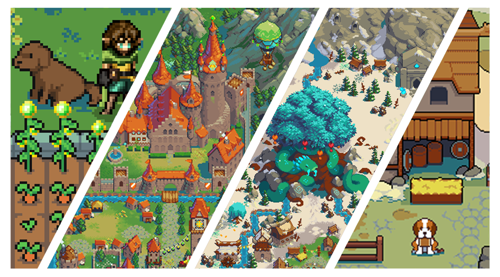

# Defi Kingdoms

## Introduzione

DeFi Kingdoms è un gioco cross-chain basato su un solido protocollo DeFi con l'intenzione di diventare un MMORPG a tutti gli effetti nelle fasi successive della Roadmap. Il gioco presenta DEX, opportunità in pool di liquidità e un mercato di NFT rari basati sull'utilità, che insieme creano un mondo online bellissimo e coinvolgente nella forma incredibilmente nostalgica della pixel art fantasy. DeFi Kingdoms attualmente vive sulle blockchain di Harmony e DFK Chain. Unisciti alla nostra fantastica [Community](https://www.defikingdoms.com/social.html)!

### La motivazione della creazione di DeFi Kingdoms

Siamo grandi fan dell'innovazione che sta accadendo nella DeFi e nella tecnologia blockchain in generale, ma stavamo aspettando un progetto DeFi per abbracciare davvero il pieno potenziale della blockchain in forma di gioco. Tradare ed ottenere quei dolci ritorni e sfruttare il rialzo di prezzo di alcune coin è senza dubbio divertente, ma perché non può essere tutto in forma di gioco? Perché non possiamo costruire qualcosa e aumentarlo di livello per aumentare i guadagni? Perché non possiamo fare missioni giornaliere per raccogliere NFT rari che influiscono sui premi e sui ritorni? Una volta deciso che doveva essere costruito, ci siamo buttati a capofitto nella produzione ed è nato DeFi Kingdoms!

### Un Team dedicato e una visione condivisa

Volevamo un DEX che permettesse ai partecipanti di possedere non solo una criptovaluta, ma di detenerne una che fosse utilizzabile, preziosa e che faccesse guadagnare in molti modi divertenti. Abbiamo confezionato elementi DeFi in un gioco divertente e sinergico, fornendo ai possessori di tokens JEWEL e CRYSTAL un'esperienza coinvolgente e significativa. Siamo qui per restare molto a lungo. Stiamo pianificando le funzionalità per le fasi a venire, e qualcuna in più lungo il percorso per crescere insieme a questa Community e proiettarci verso il massimo successo.
