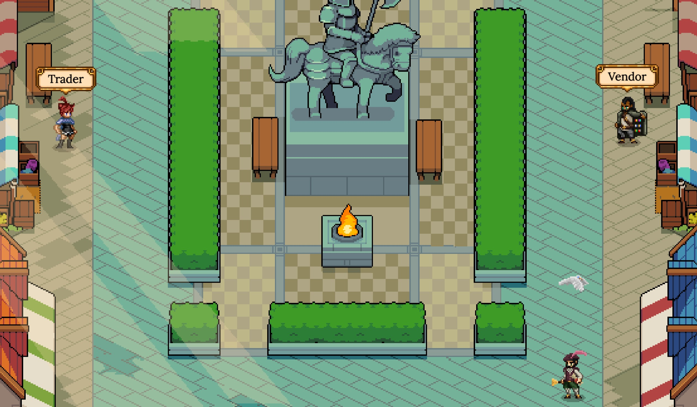

# Exchange Decentralizzato

Al suo centro, DeFi Kingdoms ha due exchange decentralizzati che utilizzano il collaudato protocollo UniswapV2. Il DEX di DeFi Kingdoms: Serendale scambia JEWEL, ONE e una serie di token su Harmony, mentre il DEX di DeFi Kingdoms: Crystalvale scambia CRYSTAL, AVAX e una varietà di token su Avalanche. Investire è uno dei motivi principali per cui siamo attratti dalla tecnologia blockchain e vogliamo rendere l'esperienza di investimento divertente e piacevole per tutti nel Regno.

Nel Marketplace, puoi scambiare i tokens ai tassi di cambio correnti. Puoi anche diventare un fornitore di liquidità aggiungendo liquidità (LP) a qualsiasi pool che desideri. Questi ti farà guadagnare commissioni ogni volta che qualcuno scambia quei token. Inoltre, questi token LP possono anche essere depositati nei Gardens per guadagnare premi in JEWEL o CRYSTAL.

