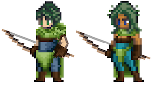

# Archer

<figure><figcaption></figcaption></figure>

Questa pagina contiene informazioni dettagliate sulle abilità di combattimento della classe Arciere che verranno utilizzate negli ambienti di combattimento Giocatore-vs-Giocatore (PVP) e Giocatore-vs-Ambiente (PVE).


Tutte le informazioni contenute in questa pagina sono considerate "Pre-Alpha" e preliminari, e sono pertanto soggette a modifiche.

Ultimo aggiornamento: 2/1/2023


## Descrizione della Classe

Ah, la classe Arciere.

Una scelta formidabile per coloro che possiedono la capacità di prendere decisioni rapide e di colpire con precisione mortale.

Diffidenti nei confronti del combattimento ravvicinato, gli Arcieri osservano i loro nemici da lontano con occhi acuti e dita abili, prendendo decisioni in una frazione di secondo per aiutare i loro compagni contro uomini o bestie. La presenza di un Arciere in un party può ribaltare le probabilità prima dell’inizio della battaglia, poiché fa piovere frecce sui nemici.

Tre archetipi guidano la fantasia di classe dell’Arciere, tutti in grado di tenere il nemico a distanza di sicurezza. La via della **Raffica (Flurry)** onora coloro che cercano di portare la morte attraverso mille tagli, mentre la via della **Precisione (Precision)** si rivolge agli Eroi pazienti che aspettano il momento ottimale per colpire. E per coloro che hanno una mente penetrante e più di una spruzzata di fortuna dalla loro parte, il sentiero **Marksmanship (Tiratore)** offre ricompense uniche.

Per padroneggiare la classe Arciere sono necessarie abilità e astuzia, sia che si preferisca colpire rapidamente sia che si aspetti l’occasione perfetta.

## Abilità da Combattimento

| SKILL POINTS | RAGGIO DI AZIONE | MANA        | TIPO DI DANNO | TIPO DI COMBO           | ABILITA’          | DESCRIZIONE                                                                                                                                                                                                                                                                                                                                                                                                                                                                            |
| ------------ | ---------------- | ----------- | ------------- | ----------------------- | ----------------- | -------------------------------------------------------------------------------------------------------------------------------------------------------------------------------------------------------------------------------------------------------------------------------------------------------------------------------------------------------------------------------------------------------------------------------------------------------------------------------------- |
| 1            | -                | Passivo     | Fisico        | Flurry (Raffica)        | Flurry            | Aumenta i danni effettivi dell’Attacco Base di X% in combattimento.                                                                                                                                                                                                                                                                                                                                                                                                                    |
| 1            | -                | Passivo     | Fisico        | Precision (Precisione)  | Precision         | Tutti gli Attacchi Base hanno una probabilità aumentata dell'X% (X = X\*DEX) di eseguire un colpo critico.                                                                                                                                                                                                                                                                                                                                                                             |
| 1            | -                | Passivo     | Fisico        | Marksmanship (Tiratore) | Marksmanship      | 
Guadagna X% di LCK effettiva in combattimento (X = X*INT).

Tutti gli Attacchi Base guadagnano un X% di perforazione.
                                                                                                                                                                                                                                                                                                                                                      |
| 2            | 3                | 
 
 | Fisico        | Flurry (Raffica)        | Multi-Shot        | 
Scaglia X frecce contro il nemico bersaglio. Ogni freccia infligge danni pari a (X*Basic).

Ogni freccia ha una possibilità indipendente di colpire in modo critico.
                                                                                                                                                                                                                                                                                                       |
| 2            | -                | Passivo     | Fisico        | Precision (Precisione)  | Shroud            | Mentre si carica, questo Eroe guadagna X% di EVA.                                                                                                                                                                                                                                                                                                                                                                                                                                      |
| 2            | 3                | 
 
 | Fisico        | Marksmanship (Tiratore) | Piercing Shot     | 
Infligge al nemico bersaglio danni pari a (X*Basic + X*DEX).

Questo attacco ha una percentuale di perforazione dell’X%.
                                                                                                                                                                                                                                                                                                                                                   |
| 3            | 3                | 
 
 | Fisico        | Flurry (Raffica)        | Rapid Shot        | 
Scaglia X frecce in modo casuale, mirando a un massimo di X nemici.

Ogni freccia infligge danni pari a (X*Basic).

<strong>COMBO</strong>: se questo Eroe ha usato Multi-Shot nel turno precedente, aumenta la Probabilità di Crit di X%.
                                                                                                                                                                                                                            |
| 3            | 3                | 
 
 | Fisico        | Precision (Precisione)  | Sharpshooter      | 
Si carica per X turni.

Infligge al nemico bersaglio danni pari a (X*Basic + X*DEX).

<strong>COMBO</strong>: Se Shroud è attivo, il prossimo Attacco Base di questo Eroe infligge danni aggiuntivi pari a (X*DEX).
                                                                                                                                                                                                                                                   |
| 3            | 3                | 
 
 | Fisico        | Marksmanship (Tiratore) | Piercing Arrow    | 
Infligge al nemico bersaglio P1 un danno pari a (X*Basic).

Infligge al nemico bersaglio P2 un danno pari a (X*Basic).

Infligge al nemico bersaglio P3 un danno pari a (X*Basic).

Questo attacco ha una percentuale di perforazione del X%. Se bloccata, la freccia arresta la sua traiettoria.

 
                                                                                                                                                     |
| 4            | 3                | 
 
 | Fisico        | Flurry (Raffica)        | Repeating Shot    | 
Scaglia X frecce contro il nemico bersaglio.

Ogni freccia infligge danni pari a (X*Basic).

<strong>COMBO</strong>: se si è preso di mira lo stesso nemico con Rapid Shot nel turno precedente, si infligge un ulteriore (X*DEX) per ogni danno inflitto.

 
                                                                                                                                                                                                 |
| 4            | 3                | 
 
 | Fisico        | Precision (Precisione)  | Dead Aim          | 
Si carica per X turni. Il prossimo turno.

Questo Eroe deve usare l'Attacco Base, che infligge danni pari a (X*Basic).

<strong>COMBO</strong>: Se Shroud è attivo, il caricamento dell’attacco può essere interrotto solo da Stun.

 
                                                                                                                                                                                                                        |
| 4            | 3                | 
 
 | Fisico        | Marksmanship (Tiratore) | One Small Stone   | 
Raccogliere una pietra dal terreno per colpire.

Infligge a X nemici bersaglio danni pari a (X*Basic*(X+(X*LCK)) ciascuno.

Questo attacco ha una percentuale di perforazione del X%.

 
                                                                                                                                                                                                                                                                      |
| 5            | 3                | 
 
 | Fisico        | Flurry (Raffica)        | Barrage           | 
Scaglia X frecce che si inarcano in aria, infliggendo danni in modo casuale a tutte le posizioni nemiche.

Ogni freccia infligge danni pari a (X*Basic).

Tuttavia, ogni freccia aggiuntiva che colpisce lo stesso nemico infligge ulteriori danni LCK. Se non c'è nessun Eroe nella posizione, i danni di quella freccia si annullano.

<em>Esempio: 2° Freccia = X*LCK; 3° Freccia = X*LCK; 4° Freccia = X*LCK; 5° Freccia = X*LCK.</em>

 

 
 |
| 5            | 3                | 
 
 | Fisico        | Precision (Precisione)  | Twin Arrows       | 
Si carica per X turni.

Il prossimo turno, questo Eroe deve usare l'Attacco Base.

Infligge ai due nemici più vicini danni pari a (X*Basic) ciascuno.

<strong>COMBO</strong>: Se lanci Dead Aim in questa battaglia, infliggi danni pari a (X*Basic).

 
                                                                                                                                                                                                |
| 5            | 3                | 
 
 | Fisico        | Marksmanship (Tiratore) | Hunter’s Mark     | 
Infligge a tutti i nemici danni pari a (X*Basic).

Tutti i nemici ricevono l'X% (X = X*LCK + X*DEX) di danni fisici aggiuntivi per X turni.
                                                                                                                                                                                                                                                                                                                                |
| 10+          | 3                | 
 
 | Fisico        | Flurry (Raffica)        | Multi-Shot +      | 
Scaglia X frecce contro il nemico bersaglio.

Ogni freccia infligge danni pari a (X*Basic).

Ogni freccia ha una probabilità indipendente di colpire in modo critico.
                                                                                                                                                                                                                                                                                                 |
| 10+          | 3                | 
 
 | Fisico        | Flurry (Raffica)        | Barrage +         | 
Spara un'intera faretra di frecce che si inarca in aria, le 6 frecce piovono e infliggono danni in modo casuale a tutti i nemici.

Ogni freccia infligge (X*Basic), ma ogni freccia aggiuntiva che colpisce lo stesso nemico infligge danni aggiuntivi LCK.

<em>Esempio: 2° freccia = X*LCK; 3° freccia = X*LCK; 4° freccia = X*LCK; 5° freccia = X*LCK.</em>

 
                                                                                             |
| 10+          | -                | Passivo     | Fisico        | Precision (Precisione)  | Shroud +          | Mentre si carica, questo Eroe guadagna X% di EVA e non può essere spinto, tirato o stordito. (pushed, pulled, stunned)                                                                                                                                                                                                                                                                                                                                                                 |
| 10+          | 3                | 
 
 | Fisico        | Precision (Precisione)  | Dead Aim +        | 
Si carica per X turni.

Il prossimo turno, questo Eroe deve sferrare un Attacco Base e infligge danni pari a (X*Basic).

<strong>COMBO</strong>: Se l'Eroe ha Shroud attivo, stordisce il bersaglio e lo rallenta del X% per X turni.

 
                                                                                                                                                                                                                      |
| 10+          | 3                | 
 
 | Fisico        | Marksmanship (Tiratore) | One Small Stone + | 
Raccogliere una pietra dal terreno per colpire.

Infligge a X nemici bersaglio danni pari a (X*Basic*(X+(X*LCK)) ciascuno.

Questo attacco ha una percentuale di perforazione del X%.

 
                                                                                                                                                                                                                                                                      |
| 10+          | 3                | 
 
 | Fisico        | Marksmanship (Tiratore) | Piercing Arrow +  | 
Infligge al nemico bersaglio P1 un danno pari a (X*Basic).

Infligge al nemico bersaglio P2 un danno pari a (X*Basic).

Infligge al nemico bersaglio P3 un danno pari a (X*Basic).

Questo attacco ha una percentuale di perforazione del X%. Se bloccata, la freccia arresta la sua traiettoria.
                                                                                                                                                                |
| 10           | 3                | 
 
 | Fisico        | Precision (Precisione)  | Pin               | 
Scaglia una freccia pesante attraverso il piede del nemico bersaglio, infliggendo danni pari a (X*Basic + X*STR + X*DEX).

Rallenta il bersaglio di X% per il resto della battaglia.
                                                                                                                                                                                                                                                                                       |
| 10           | 2                | 
 
 | Fisico        | Flurry (Raffica)        | Detonating Arrow  | 
Spara al bersaglio nemico in P2 infliggendo danni pari a (X*Basic).

Infligge a ciascun nemico in P1 e P3 danni pari a (X*Basic).
                                                                                                                                                                                                                                                                                                                                          |
| 10           | 3                | 
 
 | Fisico        | Precision (Precisione)  | Poison Arrow      | 
Infligge danni pari a (X*Basic + X*STR + X*DEX).

Avvelena il nemico bersaglio.
                                                                                                                                                                                                                                                                                                                                                                                            |
| 10           | 3                | 
 
 | Fisico        | Precision (Precisione)  | Debilitating Shot | 
Infligge danni pari a (X*Basic + X*STR + X*DEX).

Stordisce il nemico bersaglio.

<strong>COMBO</strong>: se l'Eroe ha Shroud attivo, rallenta anche il nemico bersaglio di X%.

 
                                                                                                                                                                                                                                                                            |
| 10           | 3                | 
 
 | Fisico        | Marksmanship (Tiratore) | Giant Killer      | Se il nemico bersaglio possiede più HP attuali di questo Eroe, infligge il 100% di danni da attacco bonus.                                                                                                                                                                                                                                                                                                                                                                             |
| 10           | 3                | 
 
 | Fisico        | Flurry (Raffica)        | Trick Shot        | Infligge danni al nemico bersaglio in P1 (X\*Basic + X\*DEX), P2 (X\*Basic + X\*DEX), P3 (X\*Basic + X\*DEX).                                                                                                                                                                                                                                                                                                                                                                          |
| 10           | -                | Passivo     | Fisico        | Precision (Precisione)  | Swift Quiver      | 
Guadagna un'AGI effettiva pari a (X*DEX) in combattimento.

<strong>COMBO</strong>: se Shroud è attivo, guadagna AGI aggiuntiva pari a (X*END).
                                                                                                                                                                                                                                                                                                                            |
| 10           | -                | Passivo     | Fisico        | Marksmanship (Tiratore) | Relentless Volley | 
Attivare per mettere l'Arciere in modalità Torretta.

Infligge danni pari a (X*Basic) dopo ogni turno a un nemico casuale per X turni.
                                                                                                                                                                                                                                                                                                                                     |
| 10           | -                | Passivo     | Fisico        | Flurry (Raffica)        | Flick Shot        | Ogni volta che questo Eroe riceve danno, infliggi alla fonte un danno pari a (X\*Basic).                                                                                                                                                                                                                                                                                                                                                                                               |
| 15+          | 3                | 
 
 | Fisico        | Marksmanship (Tiratore) | Masterful Shot    | 
Esegue un esecuzione su un bersaglio con meno di X% di HP.

Grado di difficoltà: -X% di precisione
                                                                                                                                                                                                                                                                                                                                                                         |

### Note

* Le abilità da 10+ punti costano 10 meno il costo della versione base dell'abilità.
* Le abilità da 15 punti sono disponibili solo per gli Eroi con una classe/sottoclasse corrispondente.
