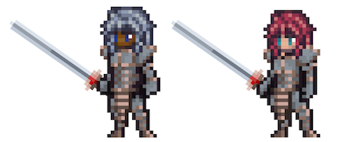

# Knight

<figure><figcaption></figcaption></figure>

Questa pagina contiene informazioni dettagliate sulle abilità di combattimento della classe Cavaliere che verranno utilizzate negli ambienti di combattimento Giocatore-vs-Giocatore (PVP) e Giocatore-vs-Ambiente (PVE).


Tutte le informazioni contenute in questa pagina sono considerate "Pre-Alpha" e preliminari, e sono pertanto soggette a modifiche.

Ultimo aggiornamento: 2/1/2023


## Descrizione della Classe

La fiducia del popolo va guadagnata, non concessa, e nessuna classe sopporta questa cruda verità con maggiore determinazione del coraggioso e onorevole Cavaliere. Dediti a sostenere la giustizia ed a proteggere gli innocenti, questi valorosi Eroi sono davvero uno spettacolo da vedere, perché sono lo scudo del popolo, addestrati nell’arte del combattimento per diventare i protettori per eccellenza.

Sebbene i Cavalieri condividano l’abilità in battaglia e la disciplina delle loro controparti guerriere, ciò che li contraddistingue è la loro perenne fedeltà verso un rigido codice cavalleresco, spesso al servizio di un Signore o di un individuo che detiene un grande potere. I Cavalieri non abbandonano mai la loro vocazione all’aiuto, anche se si trovano di fronte a difficoltà schiaccianti.

Per un Cavaliere, un’abilità forgiata in un allenamento incessante è un potere che aspetta di essere esercitato istintivamente in battaglia. A sua volta, il Cavaliere lavora instancabilmente fin da scudiero per diventare un maestro del combattimento ravvicinato. Addestrato all’arte di ostacolare le cose grandi e spaventose, il Cavaliere è sempre il primo ad attraversare la linea. Vestito da capo a piedi con una robusta armatura e dotato di una grande voglia di mischia, il Cavaliere devia gli attacchi dei suoi nemici e protegge coloro a cui tiene.

Ma il Cavaliere non è solo un abile combattente: è anche guidato da un forte senso dell’onore e del dovere, che indirizza ogni sua azione. Le loro abilità riflettono questa lealtà, concentrandosi sulla riduzione dei danni subiti, sul reindirizzare gli attacchi lontano dai deboli e sul garantire protezione al loro gruppo fidato. All’attacco, i Cavalieri colpiscono duramente per debilitare i loro nemici, stordendoli o mettendoli a tacere per dare alla loro squadra un vantaggio in battaglia o semplicemente uno spazio per respirare.

Tre sentieri portano uno scudiero al cavalierato: il sentiero dell’**Onore**, che enfatizza la difesa e la protezione degli alleati; il sentiero del **Valore**, che si concentra sulla forza e la vigilanza; e il sentiero del **Ferro**, che enfatizza il debuff e l’interruzione del nemico.

Sul campo di battaglia, il Cavaliere è una forza formidabile, che ispira i suoi alleati a combattere al suo fianco con coraggio e determinazione. Rispettato e ammirato da tutti coloro che lo conoscono, il suo nome è sinonimo di onore e dovere, nessuno più di Sir Robby Footly, il più cavaliere dei cavalieri.

## Abilità da Combattimento

<table data-header-hidden><thead><tr><th width="108"></th><th width="93"></th><th width="93"></th><th width="96"></th><th width="95"></th><th width="103"></th><th width="800"></th></tr></thead><tbody><tr><td>SKILL POINTS</td><td>RAGGIO DI AZIONE</td><td>MANA</td><td>TIPO DI DANNO</td><td>TIPO DI COMBO</td><td>ABILITA’</td><td>DESCRIZIONE</td></tr><tr><td>1</td><td>-</td><td>Passivo</td><td>-</td><td>Honor (Onore)</td><td>Honor and Glory</td><td>Incremento degli HP effettivo del X% in combattimento.</td></tr><tr><td>1</td><td>-</td><td>Passivo</td><td>-</td><td> Valor (Valore)</td><td>Valor and Truth</td><td>Incremento di STR effettivo del X% in combattimento.</td></tr><tr><td>1</td><td>-</td><td>Passivo</td><td>-</td><td>Iron (Ferro)</td><td>Iron Chivalry</td><td>Incremento di END effettivo del X% in combattimento.</td></tr><tr><td>2</td><td>-</td><td>Passivo</td><td>Fisico</td><td>Honor (Onore)</td><td>For Honor</td><td>Riduce i danni fisici a distanza subiti da tutti gli alleati in misura pari a X% (X = X*END).</td></tr><tr><td>2</td><td>-</td><td>Passivo</td><td>Fisico</td><td> Valor (Valore)</td><td>For Valor</td><td>Riduce i danni fisici subiti in misura pari a X% (X = X*END).</td></tr><tr><td>2</td><td>-</td><td>Passivo</td><td>-</td><td>Iron (Ferro)</td><td>For the King</td><td>
Incrementa STR effettiva di X%.

Incrementa END effettiva di X%. 
</td></tr><tr><td>3</td><td>1</td><td> </td><td>Fisico</td><td>Honor (Onore)</td><td>Forever Vigilant</td><td>
Infligge al nemico bersaglio danni pari a (X*Basic).

Stordisce (Daze) il nemico bersaglio.

Gli alleati ottengono una resistenza del X% allo stordimento (Dazed) per X turni.

<strong>COMBO</strong>: se “For Honor" è attivo, gli alleati ottengono una resistenza di X% allo stordimento (Dazed) per X turni.
</td></tr><tr><td>3</td><td>1</td><td> </td><td>Fisico</td><td> Valor (Valore)</td><td>Hold the Line</td><td>
Infligge al nemico bersaglio un danno pari a (X*Basic).

Spinge (Push) il nemico bersaglio X.

Gli alleati ottengono una resistenza del X% a Spinto (Pushed) e Tirato (Pushed) per X turni.

<strong>COMBO</strong>: se “For Valor" è attivo, gli alleati ottengono una resistenza del X% a Spinto (Pushed) e Tirato (Pushed) per X turni.
</td></tr><tr><td>3</td><td>1</td><td> </td><td>Fisico</td><td>Iron (Ferro)</td><td>Iron Will</td><td>
Infligge al nemico bersaglio un danno pari a (X*Basic).

Silenzia (Silece) il nemico bersaglio per X turni.

Gli alleati ottengono una resistenza del X% al Silenzio (Silenced) per X turni.

<strong>COMBO</strong>: se “For the King" è attivo, gli alleati ottengono una resistenza del X% al Silenzio (Silenced) per X Round.
</td></tr><tr><td>4</td><td>1</td><td> </td><td>Fisico</td><td>Honor (Onore)</td><td>Interception</td><td>
Infligge danni pari a (X*Basic) ad un nemico bersaglio in P1.

Reindirizza l'X% di tutti i danni fisici inflitti dai nemici in P1 a questo Eroe per il resto della battaglia.
</td></tr><tr><td>4</td><td>-</td><td>Passivo</td><td>Fisico</td><td> Valor (Valore)</td><td>Battle Ready</td><td>
Guadagna un incremento di X% di Blocco (Block).

Aumenta i danni dell'Attacco Base di X%.
</td></tr><tr><td>4</td><td>-</td><td>Passivo</td><td>Fisico</td><td>Iron (Ferro)</td><td>Ironclad Defense</td><td>
Riduce i danni a distanza subiti in misura pari a X% (X = X*END).

<strong>COMBO</strong>: se è attiva un'altra abilità Iron (Ferro), (X = X*END).
</td></tr><tr><td>5</td><td>-</td><td> </td><td>Fisico</td><td>Honor (Onore)</td><td>Royal Guard</td><td>Riduce i danni fisici subiti dell'X% e reindirizza tutti gli effetti di stato che colpiscono l'alleato in P2 a questo Eroe per X turni.</td></tr><tr><td>5</td><td>1</td><td> </td><td>Fisico</td><td> Valor (Valore)</td><td>Shield Smash</td><td>
Infligge al nemico bersaglio un danno pari a (X*Basic).

Stordisce (Stun) il nemico bersaglio.
</td></tr><tr><td>5</td><td>-</td><td> </td><td>Fisico</td><td>Iron (Ferro)</td><td>Iron Shield</td><td>
Quando attivata, riduce i danni fisici subiti di X% per X turni.

<strong>COMBO</strong>: se è attiva un'altra abilità Ferro (Iron), riduce i danni subiti del X% e questo Eroe non può essere Spinto o Tirato (Pushed o Pulled).
</td></tr><tr><td>10+</td><td>-</td><td>Passivo</td><td>Fisico</td><td>Honor (Onore)</td><td>Forever Vigilant +</td><td>
Infligge al nemico bersaglio un danno pari a (X*Basic).

Stordisce (Daze) il nemico bersaglio.

Gli alleati ottengono una resistenza del X% allo stordimento (Dazed) per X turni.

<strong>COMBO</strong>: se “For Honor" è attivo, gli alleati ottengono una resistenza di X% allo stordimento (Dazed) per X turni.
</td></tr><tr><td>10+</td><td>-</td><td> </td><td>Fisico</td><td>Honor (Onore)</td><td>Interception +</td><td>
Infligge danni pari a (X*Basic) al nemico bersaglio in P1.

Reindirizza l'X% di tutti i danni fisici dei nemici in P1 e P2 su questo Eroe per X turni.
</td></tr><tr><td>10+</td><td>-</td><td>Passivo</td><td>Fisico</td><td> Valor (Valore)</td><td>Battle Ready +</td><td>
Guadagna un incremento di X% di Blocco (Block).

Aumenta i danni dell'Attacco Base di X%.
</td></tr><tr><td>10+</td><td>1</td><td> </td><td>Fisico</td><td> Valor (Valore)</td><td>Shield Smash +</td><td>
Infligge al nemico bersaglio un danno pari a (X*Basic).

Stordisce (Stun) il nemico bersaglio.

Spinge (Push) il bersaglio X.
</td></tr><tr><td>10+</td><td>-</td><td>Passivo</td><td>-</td><td>Iron (Ferro)</td><td>For the King +</td><td>
Incrementa la STR effettiva del X%.

Incrementa la END effettiva del X%.

Guadagna X% di Riposte.
</td></tr><tr><td>10+</td><td>-</td><td> </td><td>Fisico</td><td>Iron (Ferro)</td><td>Iron Shield +</td><td>
Quando attivata, riduce i danni fisici subiti del X% per X turni.

<strong>COMBO</strong>: se è attiva un'altra abilità Ferro (Iron), gli alleati ottengono una resistenza di X% a Stordimento (Dazed) per X turni.
</td></tr><tr><td>10</td><td>-</td><td> </td><td>-</td><td> Valor (Valore)</td><td>Inspirational Words</td><td>Tutti gli alleati guadagnano STR effettiva pari a X% (X = X*END) per X turni.</td></tr><tr><td>10</td><td>-</td><td>Passivo</td><td>-</td><td>Iron (Ferro)</td><td>Cloak of Iron</td><td>Se sono attive X abilità Ferro (Iron), questo Eroe guadagna END effettiva pari a X% (X = X*VIT + X*STR).</td></tr><tr><td>10</td><td>-</td><td> </td><td>-</td><td> Valor (Valore)</td><td>Commanding Presence</td><td>Tutti gli alleati guadagnano AGI effettiva pari a X% (X = X*STR) per X turni.</td></tr><tr><td>10</td><td>-</td><td>Passivo</td><td>-</td><td>Honor (Onore)</td><td>Superior Technique</td><td>Incrementa la DEX effettiva del X%. (X = X*END).</td></tr><tr><td>10</td><td>1</td><td> </td><td>Fisico</td><td>Honor (Onore)</td><td>True Strike</td><td>Infligge al nemico bersaglio danni fisici pari a (X*Basic) con una percentuale di perforazione (Pierce) dell'X%.</td></tr><tr><td>10</td><td>-</td><td>Passivo</td><td>Fisico</td><td> Valor (Valore)</td><td>One for All</td><td>Tutti gli alleati dietro questo Eroe ottengono una riduzione dei danni fisici del X% finché questo Eroe è in vita.</td></tr><tr><td>10</td><td>-</td><td> </td><td>Fisico</td><td>Iron (Ferro)</td><td>Shield of the People</td><td>Riduce i danni subiti dagli alleati in P2 e P3 di X% per X turni.</td></tr><tr><td>10</td><td>-</td><td>Passivo</td><td>Fisico</td><td>Honor (Onore)</td><td>A Knight to Remember</td><td>Quando è al di sotto dell'X% di HP, tutti gli attacchi base e le abilità aumentano del X% la probabilità di colpo critico.</td></tr><tr><td>10</td><td>-</td><td>Passivo</td><td>-</td><td> Valor (Valore)</td><td>Live to Serve</td><td>Reindirizza tutti gli effetti di stato che colpiscono gli alleati su questo Eroe.</td></tr><tr><td>15+</td><td>3</td><td> </td><td>Fisico</td><td>Honor (Onore)</td><td>Knight King</td><td>
Infligge a P1 un danno pari a ((X*Basic)+(X*STR + X*DEX)) e a P2 e P3 l'X% di tale valore.

Spinge (Push) P1 verso P2, Tira (Pull) P2 verso P1 e stordisce (Stun) P3.

Diventa Esausto (Exhausted).
</td></tr></tbody></table>

### Note

* Le abilità da 10+ punti costano 10 meno il costo della versione base dell'abilità.
* Le abilità da 15 punti sono disponibili solo per gli Eroi con una classe/sottoclasse corrispondente.
