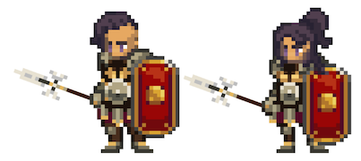

# Legionaire

<figure><figcaption></figcaption></figure>

Questa pagina contiene informazioni dettagliate sulle abilità di combattimento della classe Legionario che verranno utilizzate negli ambienti di combattimento Giocatore-vs-Giocatore (PVP) e Giocatore-vs-Ambiente (PVE).


Tutte le informazioni contenute in questa pagina sono considerate "Pre-Alpha" e preliminari, e sono pertanto soggette a modifiche.

Ultimo aggiornamento: 11/04/2023


## Descrizione della Classe

Quando tutto sembra perduto e l’oscurità si estende sul campo di battaglia, il **Legionario** emerge come un pilastro di incrollabile forza e fermezza. Come esemplare marziale, il Legionario incarna le virtù cardinali del valore, dell’abnegazione e della fedeltà incrollabile. La loro imponente presenza sul campo di battaglia è foriera di sicurezza e convinzione, infondendo coraggio ai loro confratelli e incutendo terrore nei cuori degli avversari.

Finché il Legionario resterà in piedi, la fiamma della vittoria non si spegnerà mai.

Il Legionario è un guerriero di prima linea che eccelle sia negli impegni offensivi che in quelli difensivi. Sono l’avanguardia del sodalizio, sopportando il peso degli assalti nemici e proteggendo i compagni con la loro robusta egida e l’impareggiabile forza d’animo. Grazie alla loro serie di abilità e capacità, i Legionari si adattano al vortice mutevole della battaglia, sia che si tratti di sferrare colpi paralizzanti ai nemici, sia che si tratti di dettare le sorti del combattimento, sia che si tratti di radunare i propri alleati per conquistare la vittoria contro avversità insormontabili.

Il codice delle abilità dei Legionari è una testimonianza della loro adattabilità e intraprendenza, che fonde le arti della guerra con lancia e scudo con la capacità di guidare ed elevare gli altri a nuove altezze. L’influenza del Legionario si fa sentire a ogni passo deciso, sia che scelga di **Vivere con lo Scudo**, di **Morire per la Lancia** o di abbracciare il mantello del **Leader Nato**.

Gli strenui protettori che decidono di **Vivere con lo Scudo** si ergono come baluardi di difesa e di inflessibile determinazione. Queste ancore inflessibili brandiscono abilmente i loro fidati scudi per difendere i loro alleati e se stessi dai pericoli sia mondani che arcani. Vivere con lo Scudo si concentra sull’attitudine difensiva del Legionario, potenziando la sua capacità di deviare, parare e resistere agli assalti incessanti dei nemici. Il percorso dell’Eroe con Scudo offre una maggiore protezione sia al Legionario che ai suoi confratelli, rendendoli quasi impenetrabili. Affinando la loro abilità, si trasformano in imponenti cittadelle, pronte a spostare l’equilibrio della battaglia e a resistere agli assalti più feroci.

All’interno della venerabile e mistica disciplina della lancia, coloro che decidono di **Morire per la Lancia** scoprono il loro vero scopo. Morire per la Lancia accentua le capacità offensive dei Legionari, affinando la loro padronanza della lancia per sferrare colpi rovinosi agli avversari. Questi feroci combattenti brandiscono la lancia con eleganza e precisione, abbattendo i loro nemici con la fluidità di un fiume in piena e la furia di una tempesta scatenata. Man mano che le abilità dei Legionari con la lancia si evolvono, la lancia stessa si trasforma in un’estensione della loro stessa essenza, un condotto per il loro spirito indomito. Questi abili guerrieri invocano sia l’intimidazione che la riverenza per la loro capacità di penetrare le linee nemiche e disperdere i ranghi dei loro nemici. Ogni volta che raggiungono la padronanza della lancia, sbloccano tecniche devastanti che permettono loro di colpire da lontano, di scatenare vortici di devastazione e di fare a pezzi più avversari con un solo colpo ben assestato.

Su questi campi di battaglia intrisi di sangue, il valore di un vero leader è incommensurabile. Il percorso disciplinare del **Leader Nato** trasforma i suoi discepoli in figure entusiasmanti, in grado di guidare i propri compagni e di comandare le proprie forze con sagacia, audacia e determinazione incrollabile. Questi individui possiedono un’innata dote di stratagemma, in grado di discernere i punti di forza e le vulnerabilità di alleati e nemici. Quando la loro padronanza di questa disciplina fiorisce, cresce anche la loro capacità di incoraggiare e fortificare i compagni. La loro sola presenza emerge come un faro di speranza in mezzo al calore della battaglia, sollevando gli spiriti dei loro alleati e instillando il terrore nei cuori dei loro nemici. I Leader Nati sfruttano la forza del loro carisma e della loro convinzione per rafforzare le difese dei loro fratelli e persino per modificare il corso della battaglia con la pura forza di volontà. In ultima analisi, i Leader Nati salgono alle vette della virtù, radunando le loro forze dal precipizio della sconfitta e guidandole verso una splendida vittoria. Grazie alla loro inflessibile devozione ai compagni e alla causa, questi individui incarnano davvero l’essenza della leadership, dimostrando che anche nei momenti più bui la speranza non vacilla mai.

Nelle mani del Legionario, la lancia e lo scudo diventano strumenti di abilità e precisione senza pari. La lancia permette di colpire a distanza, perforando le difese degli avversari con una precisione letale. Lo scudo, invece, non serve solo come baluardo contro gli assalti in arrivo, ma anche come formidabile arma a sé stante. La consumata padronanza di queste armi da parte dei Legionari si manifesta attraverso le loro abilità uniche, che fondono tecniche offensive e difensive per forgiare uno stile di combattimento versatile e temibile.

## Abilità da Combattimento

| SKILL POINTS | RAGGIO DI AZIONE | TIPO DI COMBO                            | DoD\*   | ABILITA’            | DESCRIZIONE                                                                                                                                                                                                                                                                                                                                                                                                                                                                                                                                                                                                                                                                                                                                        |
| ------------ | ---------------- | ---------------------------------------- | ------- | ------------------- | -------------------------------------------------------------------------------------------------------------------------------------------------------------------------------------------------------------------------------------------------------------------------------------------------------------------------------------------------------------------------------------------------------------------------------------------------------------------------------------------------------------------------------------------------------------------------------------------------------------------------------------------------------------------------------------------------------------------------------------------------- |
| 1            | 1                | Vivere con lo Scudo (Live by the Shield) | X       | Get Even            | 
<em>Una tassa per ogni insulto.</em>

Si attiva per una durata di X.

Tutti i danni fisici inflitti da questo Eroe diminuiscono del X%.

Guadagna un X% di Riposte.
                                                                                                                                                                                                                                                                                                                                                                                                                                                                                                                                                          |
| 1            | 2                | Morire per la Lancia (Die by the Spear)  | X       | Thrust              | 
<em>Prepara la lancia.</em>

Infliggi al nemico bersaglio danni fisici pari a (X*BASIC + X*STR + X*DEX).

Questo attacco ha una percentuale di Perforazione (Pierce) del X%.

Per una durata di X, guadagna (X + X*END)% di possibilità di Ritorsione X (Retaliate).
                                                                                                                                                                                                                                                                                                                                                                                                                                                         |
| 1            | 1                | Leader Nato (Born Leader)                | X       | Inspire             | 
<em>Finché il gruppo può vedervi combattere, non si perderà mai d’animo.</em>

Infligge al nemico bersaglio danni fisici pari a (X*BASIC + X*DEX).

Se questo attacco ha successo, gli alleati guadagnano (X + X*VIT)% EVA per una durata di X.
                                                                                                                                                                                                                                                                                                                                                                                                                                                                                   |
| 2            | -                | Vivere con lo Scudo (Live by the Shield) | Passivo | Live by the Shield  | 
<em>Hai scelto di diventare il muro tra i tuoi nemici e quelli che stanno in piedi da soli.</em>

Durante il combattimento, guadagni:
<ul><li>X% BLK</li><li>X% P.DEF</li><li>X% HP</li></ul>                                                                                                                                                                                                                                                                                                                                                                                                                                                                                                                                           |
| 2            | -                | Morire per la Lancia (Die by the Spear)  | Passivo | Die by the Spear    | 
<em>Hai scelto di diventare la lancia che combatte per coloro che non possono farlo.</em>

Ogni attacco riuscito di questo Eroe guadagna una probabilità (X + X*DEX)% di infliggere Sanguinamento (Bleed) al nemico bersaglio.

Per ogni pila attiva di Sanguinamento (Bleed) sul campo di battaglia, questo Eroe guadagna X% di P.ACC fino a un massimo di X%.
                                                                                                                                                                                                                                                                                                                                                                   |
| 2            | -                | Leader Nato (Born Leader)                | Passivo | Born Leader         | 
<em>Visione. Chiarezza. Previsione. La preparazione porta alla vittoria.</em>

Il vostro gruppo ottiene una resistenza del X% al Sabotaggio (Sabotage).

Questo effetto può essere impilato (Stacked).

Quando si usa un consumabile nel turno di questo Eroe, si ha una probabilità del X% di ottenere l'effetto senza ridurre il budget di battaglia.
                                                                                                                                                                                                                                                                                                                                                                      |
| 3            | 1                | Vivere con lo Scudo (Live by the Shield) | X       | Scutum Shove        | 
<em>Non c'è niente di meglio di una forte spallata al petto. Lo scudo aiuta un po’.</em>

Infligge al nemico bersaglio danni fisici pari a (X*BASIC + X*STR).

(X + X*STR)% di possibilità di Stordire (Daze) il nemico bersaglio per una durata di X.

(X + X*STR)% di probabilità di Disarmare (Disarm) il nemico bersaglio per una durata di X.
                                                                                                                                                                                                                                                                                                                                                                           |
| 3            | P2               | Morire per la Lancia (Die by the Spear)  | X       | Herculean Heave     | 
<em>L'elmo è soffocante. Lo scudo è pesante. Getta lo scudo, lancia la lancia.</em>

Si Carica (Channel) per una durata di X.

Infliggi al nemico bersaglio danni fisici in P2 pari a (X*BASIC + X*DEX + X*STR).

(X + X*DEX)% di probabilità di infliggere Sanguinamento (Bleed) al nemico bersaglio.

(X + X*DEX)% di possibilità di Stordire (Stun) il nemico bersaglio.
                                                                                                                                                                                                                                                                                                                                             |
| 3            | 1                | Leader Nato (Born Leader)                | X       | The Boot            | 
<em>Questa. È. Serendale!</em>

Infligge al nemico bersaglio danni fisici pari a (X*BASIC + X*STR + X*DEX).

(X + X*END + X*STR)% possibilità di Spingere (Push) il nemico bersaglio X.

Se ha successo, guadagna (X + X*END + X*STR)% di possibilità di Spingere (Push) il nemico bersaglio per un ulteriore X.
                                                                                                                                                                                                                                                                                                                                                                                                             |
| 4            | 3                | Vivere con lo Scudo (Live by the Shield) | X       | Look at Me          | 
<em>Il suono della lancia che si infrange sullo scudo non può essere ignorato.</em>

Reindirizza l'X% di tutti gli attacchi diretti agli alleati verso questo Eroe per una durata di X.

Guadagna l'X% di Riposte per una durata X.

<strong>COMBO</strong>: se "Scutum Shove" è stato usato nell'ultimo turno di questo Eroe, guadagna un ulteriore X% di Riposte per una durata di X.

Amnesia X.
                                                                                                                                                                                                                                                                                                                     |
| 4            | 2                | Morire per la Lancia (Die by the Spear)  | X       | Leg Sweep           | 
<em>Se gli si tolgono i piedi da sotto il naso, non possono scappare con la stessa facilità.</em>

Infligge danni fisici ai nemici bersaglio in P1 e P2 per (X*BASIC + X*DEX) ciascuno.

(X + X*DEX)% di possibilità di Stordire (Daze) il bersaglio in P1.

(X + X*DEX)% di possibilità di Stordire (Daze) il bersaglio in P2.

Per una durata di X, guadagna (X + X*END)% di possibilità di Ritorsione X (Retaliate).

<strong>COMBO</strong>: Se questo eroe ha usato "Thrust" nell'ultimo turno, guadagna una possibilità (X + X*DEX)% di Stordire (Stun) l'eroe bersaglio in P1 per una durata di X.
                                                                                                          |
| 4            | 1                | Leader Nato (Born Leader)                | X       | On Me               | 
<em>La tua lancia segna il nostro bersaglio prioritario.</em>

Infliggi al nemico bersaglio un danno fisico pari a (X*BASIC + X*STR).

(X + X*DEX + X*INT)% possibilità di Marcare (Mark) il nemico bersaglio per una durata di X.

Gli alleati infliggono X% di danni aggiuntivi al nemico bersaglio marcato per una durata di X.

Gli alleati guadagnano (X + X*STR)% di resistenza a Spingere (Push) e Tirare (Pull) per una durata di X.

<strong>COMBO</strong>: Se nell'ultimo turno di questo Eroe è stata usata l'abilità Disciplina “Leader Nato”, guadagna l'X% di Riposte per una durata di 2.
                                                                                                          |
| 5            | Alleati          | Vivere con lo Scudo (Live by the Shield) | -       | Shield Wall         | 
<em>Molti scudi diventano uno.</em>

Guadagna l'X% di Riposte per una durata di X.

Tutti i danni subiti dagli alleati vengono distribuiti in modo uniforme tra tutti i membri vivi del gruppo per una durata di X.

Tutti i membri del gruppo ottengono (X + X*STR)% di resistenza a Spingere (Push) e Tirare (Pull) per una durata di X.

<strong>COMBO</strong>: Se nell'ultimo turno di questo Eroe è stata usata l'abilità Disciplina “Vivere per lo Scudo”, ogni Alleato guadagna:
<ul><li>X% Riposte per una durata di X</li><li>X% Ritorno di Fiamma (Backfire) per una durata di X.</li></ul>                                                                                                                   |
| 5            | 2                | Morire per la Lancia (Die by the Spear)  | X       | Charge              | 
<em>Corri verso di loro.</em>

Infligge al nemico bersaglio danni fisici pari a [X*(Y*BASIC + Y*DEX)].

Il valore di X dipende dalla posizione dell'Eroe che agisce:
<ul><li>P1: X = 1,0</li><li>P2: X = 1,2</li><li>P3: X = 1,4</li></ul>
Se questo Eroe non è in P1, riposizionarlo in P1, diventa Esausto (Exhaust),

Amnesia X.

<strong>COMBO</strong>: Se il bersaglio è affetto da Sanguinamento (Bleed), guadagna una probabilità (X + X*DEX)% di Tirare (Pull) il bersaglio X.
                                                                                                                                                                                                                            |
| 5            | 3                | Leader Nato (Born Leader)                | X       | Heroic Roar         | 
<em>Date speranza al vostro party. Non ne conservi nessuna per te.</em>

Infliggi danni fisici a tutti i nemici bersaglio pari a (0).

(X + X*STR)% di possibilità di Intimidire (Intimidate) tutti i nemici per X% per una durata di X.

Gli alleati guadagnano AGI pari a (X*VIT) per una durata di X.

<strong>COMBO</strong>: Se nell'ultimo turno di questo Eroe è stata usata l'abilità Disciplina “Leader Nato”, gli alleati guadagnano (X + X*AGI)% di EVA per una durata di X.
                                                                                                                                                                                                                                 |
| 10+          | 3                | Vivere con lo Scudo (Live by the Shield) | -       | Get Even +          | 
<em>Un insulto per ogni tassa.</em>

Si attiva per una durata di X.

Tutti i danni fisici inflitti sono diminuiti del X%.

Guadagna l'X% di Riposte.

Gli attacchi di Ritorsione (Retaliate) hanno una probabilità dell'X% di infliggere l'X% di Rallentamento (Slow) al nemico bersaglio per una durata pari a X.
                                                                                                                                                                                                                                                                                                                                                                                                      |
| 10+          | 1                | Vivere con lo Scudo (Live by the Shield) | X       | Scutum Shove +      | 
<em>Non c'è niente di meglio di una forte spallata al petto. Lo scudo aiuta un po’.</em>

Infligge al nemico bersaglio danni fisici pari a (X*BASIC + X*STR).

(X + X*STR)% di probabilità di Esaurire (Exhaust) il nemico bersaglio per una durata di X.

(X + X*STR)% di possibilità di Stordire (Stun) il nemico bersaglio per una durata di X.

<strong>COMBO</strong>: Se questo Eroe è riuscito a bloccare con successo dall'ultimo turno, questa abilità guadagna (X + X*END + X*STR)% di Spingere (Push) il nemico bersaglio per una durata di X.
                                                                                                                                                               |
| 10+          | P2+P3            | Morire per la Lancia (Die by the Spear)  | X       | Herculean Heave +   | 
<em>L'elmo è soffocante. Lo scudo è pesante. Getta lo scudo, lancia la lancia.</em>

Si Carica (Channel) per una durata X.

Infliggi al nemico bersaglio danni fisici in P2 pari a (X*BASIC + X*DEX + X*STR).

Questo attacco ha una percentuale di Perforazione (Pierce) dell’X%.

(X + X*DEX)% di probabilità di infliggere Sanguinamento (Bleed) al nemico bersaglio in P2.

(X + X*DEX)% di possibilità di Stordire (Stun) il nemico bersaglio P2.

Infligge danni fisici al nemico bersaglio in P3 pari a (X*BASIC + X*DEX + X*STR).

(X + X*DEX)% di possibilità di Silenziare (Silence) il nemico bersaglio P3.
                                                                                   |
| 10+          | 2                | Morire per la Lancia (Die by the Spear)  | X       | Charge +            | 
<em>Avete capito bene.</em>

Infligge al nemico bersaglio un danno fisico pari a [X*(Y*BASIC + Y*DEX)].

Questo attacco ha una percentuale di Perforazione (Pierce) dell’Y%.

Il valore di X dipende dalla posizione dell'Eroe che agisce:
<ul><li>P1: X = 1,0</li><li>P2: X = 1,2</li><li>P3: X = 1,4</li></ul>
Se questo Eroe non è in P1, riposizionarlo in P1.

Diventa Esausto (Exhaust).

Amnesia Y.

<strong>COMBO</strong>: se il bersaglio è affetto da Sanguinamento (Bleed), guadagna una probabilità (Y + Y*DEX)% di tirare il bersaglio Y.
                                                                                                                                                  |
| 10+          | 1                | Leader Nato (Born Leader)                | X       | Inspire +           | 
<em>Le tue parole hanno un grande peso tra i giovani.</em>

Infliggi al nemico bersaglio un danno fisico pari a (0).

Provoca (Taunt) il nemico bersaglio per una durata di X.

Guadagna X% di BLK per una durata di X.

Gli alleati guadagnano (X + X*VIT)% EVA per una durata di X.
                                                                                                                                                                                                                                                                                                                                                                                                                                   |
| 10+          | 1                | Leader Nato (Born Leader)                | X       | On Me +             | 
<em>La tua lancia segnerà il nostro bersaglio prioritario.</em>

Infligge al nemico bersaglio danni fisici pari a (X*BASIC + X*STR).

(X + X*DEX + X*INT)% possibilità di Marcare (Mark) il nemico bersaglio per una durata di X.

Gli alleati infliggono X% di danni aggiuntivi ai nemici Marchiati (Mark) per una durata di X.

Gli alleati acquistano (X + X*STR)% di resistenza a Spingere (Push) e Tirare (Pull) per una durata di X.

<strong>COMBO</strong>: Se nell'ultimo turno di questo Eroe è stata usata l'abilità Disciplina "Leader Nato", guadagna X% di Riposte per una durata di X.
                                                                                                              |
| 10           | Party            | Vivere con lo Scudo (Live by the Shield) | Passivo | Parry and Protect   | 
<em>Para un attacco in arrivo, lancia lo scudo al compagno. Speriamo che lo restituisca.</em>

Guadagna X% di EVA.

Ogni volta che questo Eroe riesce a bloccare, parare o schivare un attacco in arrivo, guadagna:
<ul><li>(X + X*LCK)% di possibilità di dare a un membro casuale del gruppo una Barriera fisica con HP pari a (X*END + X*VIT + X*WIS).</li></ul>                                                                                                                                                                                                                                                                                                                                                                |
| 10           | -                | Vivere con lo Scudo (Live by the Shield) | X       | Walking Fortress    | 
<em>La sua reputazione la precede.</em>

Attivare per ottenere una Barriera fisica con HP pari a (X*STR + X*END + X*VIT).

Guadagna (X + X*END)% P.DEF per una durata di X.

Guadagna l'X% di Riposte per una durata di X.

Guadagna (X + X*STR)% di resistenza a Spingere (Push) e Tirare (Pull) per una durata di X.

Amnesia X.

<strong>COMBO</strong>: Se questo Eroe ha bloccato con successo dal suo ultimo turno, questa abilità guadagna:
<ul><li>(X + X*END + X*STR)% di possibilità di Spingere (Push) il nemico bersaglio X.</li></ul>                                                                                                                                                             |
| 10           | P2+P3            | Vivere con lo Scudo (Live by the Shield) | X       | Shield Ramp         | 
<em>Tenete lo scudo con questa angolazione, così. Ok, ora correranno verso di voi. Lanciatelo quando arrivano qui.</em>

Attiva per bersagliare un Alleato che si trova in una Posizione dietro questo Eroe.

L'alleato infligge danni fisici divisi uniformemente tra i nemici in P2 e P3 pari a [(X*Ally_BASIC + X*Ally_VIT + X*Ally_END) + (X*STR)].

(X + X*LCK)% possibilità di Spingere (Push) il bersaglio in P2 in P3.

L'alleato si riposiziona in P1 e si diventa Esausto (Exhaust).

<strong>COMBO</strong>: Se l'ultimo turno questo Eroe ha usato una qualsiasi abilità della Disciplina "Leader Nato", guadagna:
<ul><li>(X + X*LCK)% di possibilità di Stordire (Stun) il bersaglio in P3.</li></ul> |
| 10           | Alleato P2       | Morire per la Lancia (Die by the Spear)  | Passivo | On Your Six         | 
<em>Quando dico “abbassatevi”, “abbassatevi".</em>

I membri del party in P2 guadagnano:
<ul><li>X% REC</li><li>X% EVA</li><li>(X + X*STR)% Resistenza alla Paura (Fear).</li><li>(X + X*STR)% Resistenza a Spingere (Push) e Tirare (Pull).</li></ul>                                                                                                                                                                                                                                                                                                                                                                                                                                                                                  |
| 10           | 3                | Morire per la Lancia (Die by the Spear)  | X       | Spear from the Gods | 
<em>Puntate la lancia verso il cielo. Gli dei vi concedono il dono del fulmine. Salta in aria e scagliala contro il nemico.</em>

Si Carica (Channel) per una durata di X.

Infligge danni fisici pari a (X*BASIC + X*DEX) al nemico bersaglio.

(X + X*DEX)% di possibilità di Silenziare (Silence) il nemico bersaglio per una durata di X.

(X + X*DEX)% di possibilità di Stordire (Stun) il nemico bersaglio per una durata di X.

Infligge danni fisici pari a (X*BASIC + X*DEX) a ogni nemico adiacente.
                                                                                                                                                                                                    |
| 10           | 1                | Morire per la Lancia (Die by the Spear)  | X       | Press the Advantage | 
<em>Colpisci duro e non mostrare pietà.</em>

Infligge al nemico bersaglio danni fisici pari a (X*BASIC + X*STR + X*DEX).

(X + X*FINE)% di possibilità di Ritorsione X (Retaliate) per una durata di X.

Se il bersaglio è affetto da Sanguinamento (Bleed), guadagna:
<ul><li>(X + X*DEX)% di possibilità di Stordire (Stun) il bersaglio per una durata di X.</li></ul>
<strong>COMBO</strong>: Se nell'ultimo turno di questo Eroe è stata usata l'abilità Disciplina "Vivere con lo Scudo", guadagna:
<ul><li>(X + X*DEX)% di Spingere (Push) il nemico bersaglio X.</li></ul>                                                                                                                                      |
| 10           | -                | Leader Nato (Born Leader)                | Passivo | Hold Steady         | 
<em>Fermate i vostri piedi ora. Dai l’esempio.</em>

Questo Eroe guadagna:
<ul><li>X% di probabilità di ottenere Ritorsione X (Retaliate) su attacchi in arrivo riusciti che hanno come bersaglio gli alleati.</li></ul>
Gli alleati guadagnano:
<ul><li>X% P.DEF. (X + X*END)% Resistenza a Spingere (Push) e Tirare (Pull). </li></ul>
La END indicata qui è la END del Legionarie, non quella del bersaglio.
                                                                                                                                                                                                                                                                                                              |
| 10           | Alleati          | Leader Nato (Born Leader)                | X       | Take the Point      | 
<em>Cambio!</em>

Riposiziona questo Eroe.

Guadagna un X% di BLK per una durata di X.

Gli alleati dietro questo Eroe ottengono (X + X*END)% di possibilità di Ritorsione X (Retaliate) per una durata di X.

Amnesia X.

<strong>COMBO</strong>: Se nell'ultimo turno di questo Eroe è stata usata una qualsiasi abilità della Disciplina "Vivere con la Scudo", guadagna:
<ul><li>(X + X*END)% di resistenza a Spingere (Push) e Tirare (Pull) per una durata di X.</li></ul>                                                                                                                                                                                                                                    |
| 10           | Alleati          | Leader Nato (Born Leader)                | -       | Fall Back           | 
<em>È ora di riorganizzarsi e rivalutare.</em>

Guadagna X% di EVA per una durata di X.

Riposiziona l'alleato bersaglio.

L'Eroe alleato bersaglio guadagna una Barriera Fisica con HP pari a (X*Max_HP).

<strong>COMBO</strong>: se “Heroic Roar" è stato usato nell'ultimo turno di questo Eroe, l'Alleato bersaglio guadagna un aumento del X% dei danni inflitti per una durata di X.
                                                                                                                                                                                                                                                                                                                             |
| 15+          | Party            | Leader Nato (Born Leader)                | Passivo | Coordinated Attack  | 
<em>Ribalta le sorti della battaglia con una mossa perfetta.</em>

Ogni X durate, tutti i membri del party guadagnano X% P.ACC e Focus per una durata di X.

Ogni X durate, tutti i membri del party guadagnano X% CSC per una durata di X.

Ogni X durate, tutti i membri del party guadagnano X% di Perforazione (Pierce) per una durata di X.

Ogni X durate, tutti i membri del party guadagnano X% di Danni da Attacco per una durata di X.
                                                                                                                                                                                                                                                                        |

### Note

* Le abilità da 10+ punti costano 10 meno il costo della versione base dell'abilità.
* Le abilità da 15 punti sono disponibili solo per gli Eroi con una classe/sottoclasse corrispondente.
