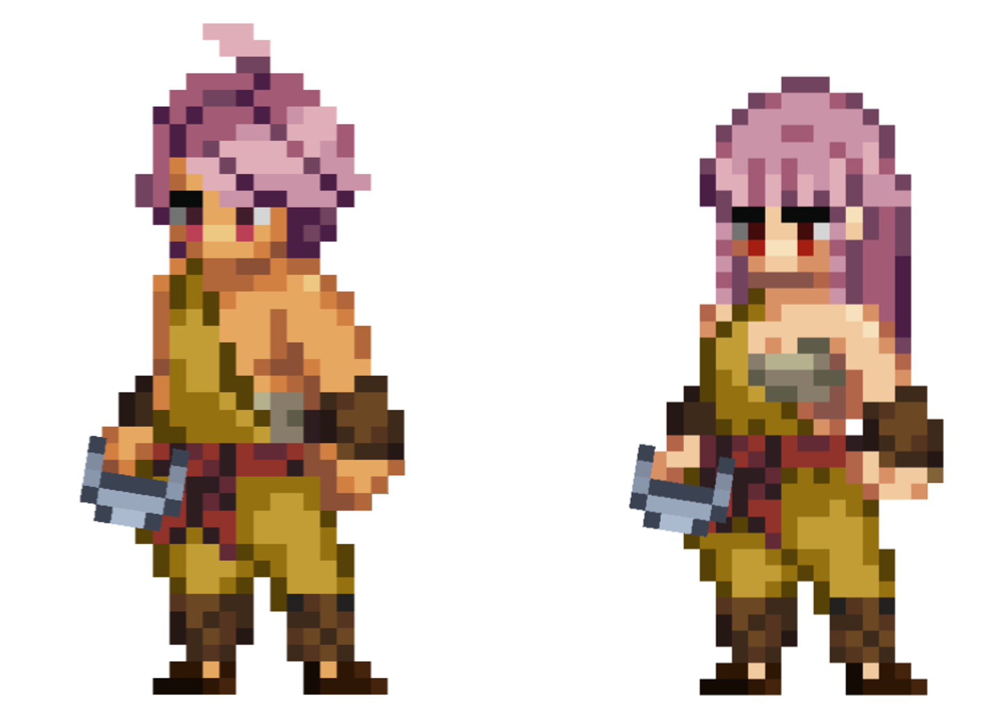

# Monk

<figure><figcaption></figcaption></figure>

Questa pagina contiene informazioni dettagliate sulle abilità di combattimento della classe Monaco che verranno utilizzate negli ambienti di combattimento Giocatore-vs-Giocatore (PVP) e Giocatore-vs-Ambiente (PVE).


Tutte le informazioni contenute in questa pagina sono considerate "Pre-Alpha" e preliminari, e sono pertanto soggette a modifiche.

Ultimo aggiornamento: 06/05/2023


## Descrizione della Classe

Nel bel mezzo di un campo di battaglia in cui si combatte con la spada, lo scudo e l’arcano, il **Monk** si fa avanti, un’armoniosa convergenza di mente, corpo e spirito. Questi pellegrini attraversano un sentiero intessuto di riflessione interiore e abilità marziale, emergendo come manifestazioni viventi del potere trascendente.

Nel grande arazzo dell’esistenza, i Monaci sono i fili meticolosamente tessuti dell’energia illuminata. Queste anime devote sono diventate maestri manipolatori del “ki”, l’energia insita in ogni forma di vita, che conferisce loro capacità che sfidano il banale e balzano nello straordinario. Con menti disciplinate e pugni potenti, i Monaci incidono il testamento della loro volontà sul mondo, dimostrando che il viaggio verso l’illuminazione non è solo una ricerca personale, ma un faro di speranza per gli afflitti ed un baluardo inflessibile contro le forze del caos.

Il viaggio di un Monaco è dipinto con i tratti di tre discipline distinte, ognuna delle quali illumina una sfaccettatura unica della sua identità. Ogni percorso dimostra la versatilità del Monaco, mostrando la moltitudine di modi in cui i suoi poteri possono manifestarsi.

Coloro che percorrono la via del **Pugno Chiuso (Closed Fist)** sono artigiani della forza inflessibile. Questi Monaci trascrivono la loro storia con colpi devastanti e difese inattaccabili, ogni impatto è una strofa di potere che risuona sul campo di battaglia. Incanalano il loro ki per resistere agli assalti e, con un singolo colpo mirato, possono rovesciare anche il nemico più potente. Questa disciplina permette ai Monaci di rimanere saldi in prima linea, una forza inflessibile tra i fuochi del combattimento.

In netto contrasto, i seguaci della via del **Palmo Aperto (Open Palm)** tessono la loro storia con colpi più delicati, ma ugualmente potenti. Padroneggiano il flusso e il riflusso dell’energia e i loro doni marziali vengono sfruttati per reindirizzare le forze ostili e far cadere gli avversari. Utilizzando il loro ki sia come scudo che come molla, si difendono e deviano con una facilità che smentisce la loro profonda abilità. Questa via permette ai monaci di dettare il ritmo della battaglia, una danza in cui sono sia il coreografo che il protagonista.

Infine, la via dello **Stile dell’Ubriaco (Druken Sway)** è un verso esoterico della saga del Monaco. Questi guerrieri apparentemente instabili trovano l’armonia nello squilibrio, i loro movimenti sono imprevedibili e al tempo stesso mirati. Incanalano il loro ki per imitare l’oscillazione imprevedibile degli ebbri, facendo sì che i nemici giudichino male i loro movimenti e vacillino. Questo percorso trasforma il Monaco in un enigma sfuggente sul campo di battaglia, apparentemente incerto ma sempre un passo avanti.

Il Monaco, in tutta la sua grandezza mistica, sfida i paradigmi tradizionali di forza fisica e potere arcano. Intrecciando la forza del corpo, la determinazione della mente e l’energia dello spirito, i Monaci offrono una testimonianza del potere dell’equilibrio interno e della consapevolezza di sé. Che siano gli implacabili guerrieri del Pugno Chiuso, gli aggraziati difensori del Palmo Aperto o il caos controllato dello Stile dell’Ubriaco, servono a ricordare che il potere più profondo spesso emana dall’interno, coltivato attraverso la saggezza, la disciplina e l’infinita ricerca dell’illuminazione. È qui che prospera il Monaco, simbolo di grazia, forza e saggezza, perfettamente in sintonia con il ritmo eterno del cosmo.

## Abilità da Combattimento

<table data-header-hidden><thead><tr><th width="110"></th><th width="113"></th><th width="167"></th><th width="93"></th><th width="143"></th><th width="800"></th></tr></thead><tbody><tr><td>SKILL POINTS</td><td>RAGGIO DI AZIONE</td><td>TIPO DI COMBO</td><td>DoD*</td><td>ABILITA’</td><td>DESCRIZIONE</td></tr><tr><td>1</td><td>1</td><td>Pugno Chiuso (Closed Fist)</td><td>X</td><td>Crippling Strike</td><td>
Infligge al nemico bersaglio danni fisici pari a (X*BASIC + X*STR + X*DEX).

(X + X*STR + X*DEX)% di probabilità di Stordire (Daze) il nemico bersaglio.
</td></tr><tr><td>1</td><td>1</td><td>Palmo Aperto (Open Palm)</td><td>X</td><td>Blinding Weave</td><td>
Infligge al nemico bersaglio danni fisici pari a (X*BASIC + X*DEX + X*WIS).

(X + X*DEX + X*WIS)% di possibilità di Accecare (Blind) il nemico bersaglio.
</td></tr><tr><td>1</td><td>Se Stessi</td><td>Stile dell’Ubriaco (Drunken Sway)</td><td>-</td><td>Swig</td><td>
<em>Tieni, bevi questo. Aiuta.</em>

Si Carica (Channel) per una durata di X.

Guadagna (X + X*END)% P.DEF per una durata di X.

Guadagna (X + X*DEX)% EVA per una durata di X.
</td></tr><tr><td>2</td><td>Passiva</td><td>Pugno Chiuso (Closed Fist)</td><td>Passiva</td><td>Closed Fist</td><td>Tutti gli attacchi riusciti di questo Eroe guadagnano una probabilità (X + X*STR)% di Spingere (Push) il nemico bersaglio 1.</td></tr><tr><td>2</td><td>Passiva</td><td>Palmo Aperto (Open Palm)</td><td>Passiva</td><td>Open Palm</td><td>Mentre è in battaglia, questo Eroe guadagna un (X + X*DEX)% di possibilità di Ritorsione (Retaliate) X.</td></tr><tr><td>2</td><td>Passiva</td><td>Stile dell’Ubriaco (Drunken Sway)</td><td>Passiva</td><td>Drunken Sway</td><td>
Durante la Carica (Channel), questo Eroe guadagna una Barriera Fisica pari a (X + X*FINE)% degli HP attuali di questo Eroe.

Al termine della Carica (Channel), la Barriera Fisica viene distrutta.
</td></tr><tr><td>3</td><td>1</td><td>Pugno Chiuso (Closed Fist)</td><td>X</td><td>Five Fists</td><td>
<em>La forza è ottima e tutto, ma colpirli nel punto giusto al momento giusto fa miracoli.</em>

Riposizionarsi in P1.

Infligge X istanze di danno fisico al nemico bersaglio, ogni istanza è pari a (X*BASIC + X*STR + X*DEX).

Per ogni colpo critico riuscito, ogni istanza ha una probabilità (X + X*STR)% di Stordire (Daze) il nemico bersaglio.

<strong>COMBO</strong>: se “Power Stance" è attiva, guadagna: (X + X*STR)% di possibilità di Spingere (Push) il nemico bersaglio 1.

Amnesia X
</td></tr><tr><td>3</td><td>3</td><td>Palmo Aperto (Open Palm)</td><td>X</td><td>Soothing Palm</td><td>
Riposizionarsi in P1.

Infligge danni fisici a ogni nemico bersaglio pari a (X*BASIC + X*DEX + X*STR).

(X + X*DEX + X*WIS)% possibilità di Disarmare (Disarm) il nemico bersaglio in P1 per una durata di X.

(X + X*DEX + X*WIS)% possibilità di Disarmare (Disarm) il nemico bersaglio in P2 per una durata di X.

(X + X*DEX + X*WIS)% possibilità di Disarmare (Disarm) il nemico bersaglio in P3 per una durata di X.

<strong>COMBO</strong>: se "Ready Stance" è attiva, guadagna:

Purifica (Cleanse) di tutti i membri del gruppo.

Amnesia X.
</td></tr><tr><td>3</td><td>3</td><td>Stile dell’Ubriaco (Drunken Sway)</td><td>X</td><td>Stumble</td><td>
<em>Inciampi e cadi contro i nemici. Succede.</em>

Riposizionarsi in P1.

Infligge a ogni nemico danni fisici pari a (X*BASIC + X*STR + X*END).

(X + X*LCK) possibilità di Provocare (Taunt) il nemico P1 per una durata pari a X.

(X + X*LCK) possibilità di Provocare (Taunt) il nemico P2 per una durata pari a X.

(X + X*LCK) possibilità di Provocare (Taunt) il nemico P3 per una durata pari a X.

<strong>COMBO</strong>: se è attiva "Flow Stance", guadagna una Barriera fisica pari all'X% degli HP attuali di questo Eroe.

Diventa Esausto (Exhausted).

Amnesia X.
</td></tr><tr><td>4</td><td>Se Stessi</td><td>Pugno Chiuso (Closed Fist)</td><td>-</td><td>Power Stance</td><td>
Attivare per ottenere "Power Stance" per una durata di X.

Riposiziona questo Eroe 1.

Mentre è attivo, ottiene i seguenti effetti:

+X% AGI.

+X% BLK.

+(X + X*DEX)% CSC.

Ogni volta che questo Eroe riesce a sferrare un Colpo Critico, guadagna:

(X + X*STR)% possibilità di Spingere (Push) il nemico bersaglio di 1.

Si rinfresca e non si accumula.
</td></tr><tr><td>4</td><td>Se Stessi</td><td>Palmo Aperto (Open Palm)</td><td>-</td><td>Ready Stance</td><td>
Attivare per ottenere "Ready Stance" per una durata di X.

Riposiziona questo Eroe 1.

Mentre è attivo, ottiene i seguenti effetti:

+X% EVA.

+(X + X*WIS)% BLK.

(X + X*DEX)% possibilità di Ritorsione (Retaliate) X.

Ogni volta che questo Eroe blocca un attacco in arrivo, guadagna una probabilità (X + X*WIS)% di Disarmare (Disarm) il nemico bersaglio dell'attacco per una durata pari a X.

Si rinfresca e non si accumula.
</td></tr><tr><td>4</td><td>Se Stessi</td><td>Stile dell’Ubriaco (Drunken Sway)</td><td>-</td><td>Flow Stance</td><td>
<em>Evitare semplicemente i danni non è sufficiente. Bisogna sapere quando contrattaccare.</em>

Attivare per ottenere la posizione "Flow Stance" per una durata di X.

Riposiziona questo Eroe 1.

Mentre è attivo, ottiene i seguenti effetti:

+(X + X*LCK)% EVA.

+(X + X*END)% P.DEF.

Ogni volta che questo Eroe evita un attacco, guadagna una possibilità (X + X*LCK)% di Provocare (Taunt) un nemico a caso per una durata di X.

Si rinfresca e non si accumula.
</td></tr><tr><td>5</td><td>2</td><td>Pugno Chiuso (Closed Fist)</td><td>X</td><td>Grand Slam</td><td>
<em>Sfruttate la vostra energia vitale interiore. Ora proiettatela verso l’esterno.</em>

Si Carica (Channel) per una durata di 1.

Infligge danni fisici pari a (X*BASIC + X*STR) al nemico bersaglio in P1.

(X + X*DEX)% di possibilità di Spingere (Push) il nemico bersaglio in P1 verso P2.

Se la spinta ha successo, infligge danni fisici pari a (X*BASIC + X*STR) al nemico bersaglio che ora si è spostato in P1.

<strong>COMBO</strong>: Se questo Eroe ha usato "Five Fists" nell'ultimo turno, guadagna:

(X + X*DEX)% di possibilità di Esaurire (Exhaust) il nemico bersaglio in P1.

Amnesia X.
</td></tr><tr><td>5</td><td>3</td><td>Palmo Aperto (Open Palm)</td><td>X</td><td>Ki Blast</td><td>
Si Carica (Channel) per una durata di 1.

Infligge danni fisici pari a (X*BASIC + X*VIT + X*WIS) al nemico bersaglio.

(X + X*DEX)% di possibilità di Bandire (Banish) il nemico bersaglio in P1 per una durata X.

<strong>COMBO</strong>: Se questo Eroe ha usato "Soothing Palm" nel suo ultimo turno, guadagna:

Mentre si Carica (Channel), guarisce per (X*VIT) per ogni turno nemico.

Amnesia X.
</td></tr><tr><td>5</td><td>3</td><td>Stile dell’Ubriaco (Drunken Sway)</td><td>X</td><td>Stagger</td><td>
Riposizionarsi in P1.

(X + X*LCK)% di possibilità di Provocare (Taunt) ogni nemico.

<strong>COMBO</strong>: Se questo Eroe ha usato "Stumble" nell'ultimo turno, guadagna:

X% P.DEF per una durata di X.

Si Carica (Channel) per una durata di X.

Alla fine della Carica (Channel), infliggi un danno pari all'X% dei danni ricevuti durante la Carica (Channel) al nemico bersaglio in P1.

Amnesia X.

<em>Nota: gli effetti si verificano nell'ordine scritto.</em>
</td></tr><tr><td>10+</td><td>1</td><td>Pugno Chiuso (Closed Fist)</td><td>X</td><td>Crippling Strike +</td><td>
Infligge al nemico bersaglio danni fisici pari a (X*BASIC + X*STR + X*DEX).

(X + X*STR + X*DEX)% possibilità di Stordire (Daze) il nemico bersaglio.

<strong>COMBO</strong>: Se questo Eroe ha usato "Attacco Base" nel suo ultimo turno, lancia immediatamente di nuovo "Crippling Strike" sullo stesso bersaglio.
</td></tr><tr><td>10+</td><td>-</td><td>Pugno Chiuso (Closed Fist)</td><td>-</td><td>Power Stance +</td><td>
Attivare per ottenere “Power Stance" per una durata di X.

Riposiziona questo Eroe 1.

Mentre è attivo, ottiene i seguenti effetti:

+X% AGI.

+X% BLK.

+(X + X*DEX)% CSC.

Ogni volta che questo Eroe riesce a sferrare un Colpo Critico, guadagna:

(X + X*STR)% possibilità di Spingere (Push) il nemico bersaglio di 1.

Si rinfresca e non si accumula.
</td></tr><tr><td>10+</td><td>1</td><td>Palmo Aperto (Open Palm)</td><td>X</td><td>Blinding Weave +</td><td>
Infligge al nemico bersaglio danni fisici pari a (X*BASIC + X*DEX + X*WIS).

(X + X*STR + X*DEX)% di possibilità di Accecare (Blind) il nemico bersaglio.

<strong>COMBO</strong>: se il bersaglio è affetto da Accecamento (Blind), guadagna:

(X + X*INT)% di probabilità di Disarmare (Disarm) il nemico bersaglio per una durata pari a X.
</td></tr><tr><td>10+</td><td>-</td><td>Palmo Aperto (Open Palm)</td><td>-</td><td>Ready Stance +</td><td>
Attivare per ottenere "Ready Stance" per una durata di X.

Riposiziona questo Eroe 1.

Mentre è attivo, ottiene i seguenti effetti:

+X% EVA.

+(X + X*WIS)% BLK.

(X + X*DEX)% possibilità di Ritorsione (Retaliate) X.

Ogni volta che questo Eroe blocca un attacco in arrivo mentre è attiva “Ready Stance", guadagna una possibilità (X + X*WIS)% di Disarmare (Disarm) il nemico bersaglio dell'attacco per una durata pari a X.

Si rinfresca e non si accumula.
</td></tr><tr><td>10+</td><td>-</td><td>Stile dell’Ubriaco (Drunken Sway)</td><td>-</td><td>Swig +</td><td>
<em>Tieni, bevi questo. Aiuta.</em>

Si Carica (Channel) per una durata di X.

Guadagna (X + X*END)% P.DEF per una durata di X.

Guadagna (X + X*DEX)% EVA per una durata di X.

<strong>COMBO</strong>: Se questo Eroe ha usato "Attacco Base" nel suo ultimo turno, guadagna un ulteriore X% di P.DEF per una durata di X.
</td></tr><tr><td>10+</td><td>-</td><td>Stile dell’Ubriaco (Drunken Sway)</td><td>-</td><td>Flow Stance +</td><td>
<em>Evitare semplicemente i danni non è sufficiente. Bisogna sapere quando contrattaccare.</em>

Attivare per ottenere Oscillazione (Sway) per una durata di X.

Riposiziona questo Eroe 1.

Mentre è attivo, ottiene i seguenti effetti:

(X + X*LCK)% EVA.

(X + X*END)% P.DEF.

Ogni volta che questo Eroe evita un attacco mentre è attivo, guadagna una possibilità (X + X*LCK)% di Provocare (Taunt) un nemico a caso per una durata di X.

Si rinfresca e non si accumula.
</td></tr><tr><td>10</td><td>Passiva</td><td>Pugno Chiuso (Closed Fist)</td><td>Passiva</td><td>Unwavering Resolve</td><td>
In "Power Stance", guadagna:

X% P.DEF.

X% M.DEF.

X% di resistenza a tutti gli effetti di stato.

X% BLK.
</td></tr><tr><td>10</td><td>3</td><td>Pugno Chiuso (Closed Fist)</td><td>X</td><td>Disrupt Ki</td><td>
Questa abilità è disponibile solo quando si è in "Power Stance”.

Infligge al nemico bersaglio danni fisici pari a (X*BASIC + X*STR + X*DEX).

(X + X*WIS)% possibilità di infliggere Amnesia X a un'abilità casuale dell'Eroe bersaglio.

<strong>COMBO</strong>: Se questo Eroe ha usato "Meditate" nel suo ultimo turno, guadagna:

(X + X*WIS)% di possibilità di Silenziare (Silence) il nemico bersaglio per una durata di X.
</td></tr><tr><td>10</td><td>1</td><td>Pugno Chiuso (Closed Fist)</td><td>X</td><td>One Punch</td><td>
Si Carica (Channel) per una durata di X.

Infligge al nemico bersaglio danni fisici pari a (X*BASIC + X*STR + X*DEX).

(X + X*STR)% possibilità di Bandire (Banish) il nemico bersaglio per una durata di X.

Diventa Esausto (Exhausted).

Amnesia X.
</td></tr><tr><td>10</td><td>Passiva</td><td>Palmo Aperto (Open Palm)</td><td>Passiva</td><td>Guide Momentum</td><td>
Mentre è in "Ready Stance", ogni volta che l'Eroe Evita, Blocca o Reagisce ad un attacco in arrivo, guadagna:

X% di possibilità di Stordire (Daze) l’attaccante.

X% di possibilità di Tirare (Pull) 1 l’Eroe attaccante.

X% di possibilità di Esaurire (Exhaust) l’eroe attaccante per una durata di X.
</td></tr><tr><td>10</td><td>3</td><td>Palmo Aperto (Open Palm)</td><td>X</td><td>Shatter</td><td>
Questa abilità è disponibile solo quando si è in “Ready Stance”.

Infligge al nemico bersaglio un danno fisico pari a (0).

(X + X*WIS)% possibilità di distruggere le Barriere del nemico bersaglio.

Per ogni barriera distrutta, il nemico bersaglio subisce danni fisici pari all'X% del valore attuale degli HP di ogni barriera distrutta.
</td></tr><tr><td>10</td><td>Se Stessi</td><td>Palmo Aperto (Open Palm)</td><td>-</td><td>Meditate</td><td>
<em>Prendetevi un momento per voi stessi. Liberate la mente.</em>

Riposizionarsi questo Eroe 2.

Si Carica (Channel) per una durata di X.

Cura questo Eroe pari a (X*WIS + X*VIT).

Purifica (Purify) questo Eroe.

Guadagna X% di P.ACC per una durata di X.

Guadagna X% di EVA per una durata di X.
</td></tr><tr><td>10</td><td>Passiva</td><td>Stile dell’Ubriaco (Drunken Sway)</td><td>Passiva</td><td>Liquid Courage</td><td>Mentre è in "Flow Stance" e all'inizio di ogni turno del nemico, guadagna una probabilità (X + X*LCK)% di Provocare (Taunt) il nemico per il suo turno corrente.</td></tr><tr><td>10</td><td>1</td><td>Stile dell’Ubriaco (Drunken Sway)</td><td>X</td><td>Stunning Momentum</td><td>
Questa abilità è disponibile solo quando si è in "Flow Stance”.

Diventa Inarrestabile (Unstoppable) per una durata di X.

Infligge al nemico bersaglio danni fisici pari a (X*BASIC + X*END).

(X + X*LCK)% di possibilità di Stordire (Stun) il nemico bersaglio.

<strong>COMBO</strong>: Se questo Eroe ha usato "Meditate" nel suo ultimo turno, guadagna:

(X + X*LCK)% di possibilità di Ripetere X, fino a un massimo di X.

Amnesia X.
</td></tr><tr><td>10</td><td>3</td><td>Stile dell’Ubriaco (Drunken Sway)</td><td>X</td><td>Into the Fray</td><td>
Si Carica (Channel) per una durata di X.

Durante la Carica (Channel), guadagna:

+(X + XLCK)% EVA.

+(X + XLCK)% BLK.

-X% P.DEF.

Ogni volta che questo Eroe riceve un danno, guadagna una probabilità X% di Ritorsione (Retaliate) X.

Ogni volta che questo Eroe effettua una Ritorsione (Retaliate), guadagna una probabilità dell'X% di Confondere (Confuse) il nemico bersaglio.

Ogni volta che questo Eroe Evita un attacco, guadagna un X% di probabilità di Accecare (Blind) il nemico che lo attacca.

Ogni volta che questo Eroe Blocca un attacco, guadagna una probabilità dell'X% di Tirare (Pull) il nemico che lo attacca.

Quando la Carica (Channel) viene completata con successo, infligge danni fisici pari a (XBASIC + XSTR + X*LCK) a ciascun nemico.

<strong>COMBO</strong>: se il nemico bersaglio è Confuso (Confuse) o Accecato (Blind), infligge danni fisici aggiuntivi pari a (XBASIC + X*STR + X*LCK). 
</td></tr><tr><td>15+</td><td>Passiva</td><td>Palmo Aperto (Open Palm)</td><td>Passiva</td><td>Sleeping Dragon</td><td>
Ogni volta che gli HP di questo Eroe verrebbero ridotti a 0 per la prima volta in battaglia, previeni il danno e ottieni immediatamente una serie di effetti:

Cura questo Eroe pari a (X*WIS + X*VIT).

Purifica (Purify) questo Eroe.

Guadagna X% di EVA per una durata di X.

Diventa Esausto (Exhausted) per una durata di X.
</td></tr></tbody></table>

### Note

* Le abilità da 10+ punti costano 10 meno il costo della versione base dell'abilità.
* Le abilità da 15 punti sono disponibili solo per gli Eroi con una classe/sottoclasse corrispondente.
