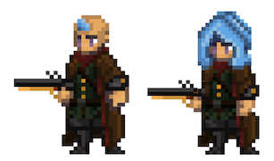

# Pirate

<figure><figcaption></figcaption></figure>

Questa pagina contiene informazioni dettagliate sulle abilità di combattimento della classe Pirata che verranno utilizzate negli ambienti di combattimento Giocatore-vs-Giocatore (PVP) e Giocatore-vs-Ambiente (PVE).


Tutte le informazioni contenute in questa pagina sono considerate "Pre-Alpha" e preliminari, e sono pertanto soggette a modifiche.

Ultimo aggiornamento: 07/2/2023


## Descrizione della Classe

Che si tratti di un astuto lupo di mare o di un audace furfante, è quasi impossibile resistere al richiamo del mare ed il **Pirata** è una classe di Eroi che non sa dire di no. Un vero Pirata assapora un buon gioco d’azzardo e si diverte a vivere sul filo di una lama sottile, nel bene e nel male. Coloro che scelgono di abbracciare la vita di un Pirata lo fanno con uno spirito impavido, una sete di avventura e una voglia ancora maggiore di rischiare tutto. La loro padronanza del vento e delle onde è una testimonianza della loro audacia e della loro incrollabile determinazione a tracciare il proprio percorso di vita. Che si tratti del ruggito delle loro armi da fuoco, del lampo dei loro coltelli o degli scherzi del destino, il Pirata è una forza con cui fare i conti.

Il Pirata è una classe versatile e imprevedibile, in grado di adattarsi a qualsiasi situazione con facilità. Sono veloci nei piedi e agili con le lame, il che li rende formidabili nei combattimenti corpo a corpo, ma non esitano a sventolare un fidato archibugio. Possono invocare il potere delle maree e dei venti, usandolo per rafforzare la loro forza e condurre i loro compagni alla vittoria. Possono anche evocare temibili creature marine per eseguire i loro ordini. Ma i Pirati non sono privi di difetti. Il loro amore per l’avventura e il tesoro può talvolta condurli su una strada pericolosa, facendoli correre rischi che gli Eroi più umili potrebbero evitare, e i loro tre percorsi di abilità riflettono questa affinità con il pericolo.

Il percorso del **Demolitore (Busster)** si concentra sugli attacchi a distanza con una temibile pistola archibugio. Per padroneggiare questo percorso è necessaria una notevole dose di destrezza, che consente al Pirata di eliminare i nemici da lontano con il suo dragone bombastico. Che si tratti di un colpo di avvertimento che mette al tappeto un avversario, di un’assordante esplosione che infligge danni fisici a più nemici o di una travolgente esplosione che distrugge le barriere, il Pirata non scherza da dietro il mirino.

Il secondo percorso è quello che onora le antiche e sempre rispettate linee guida del **Codice dei Pirati (The Pirate Code)**. Questo percorso riflette gli elementi che definiscono cosa significhi essere una canaglia spavalda che vive al di fuori degli scomodi confini della legge. In un ambiente ostile come quello dei discorsi diplomatici ravvicinati, sono necessarie una lama sguainata e una grande dose di forza. Un Jenkins sfortunato potrebbe trovarsi rapidamente in difficoltà a causa di un rapido fendente che, se non trattato adeguatamente, potrebbe essere una questione di vita o di morte. E se questo non bastasse, c’è sempre una bella camminata fuori dall’asse per incontrare il proprio creatore nelle torbide profondità sottostanti.

Infine, il Pirata ha il suo unico vero amore, il mare stesso. La via della **Fortuna del Mare (Luck of the Sea)** consiste nel confidare nel cuore dell’oceano e nell’affidarsi ai misteri che la pirateria ha portato alla luce nel corso di generazioni di giocatori d’azzardo e ruffiani. L’astuzia, la fortuna e, naturalmente, un kraken gigante sono sempre risorse affidabili per ribaltare le sorti della battaglia. Ma i vantaggi che il mare offre possono anche essere strappati via. Questa via è di gran lunga la più pericolosa e rischiosa di tutte, ma nasconde anche le più grandi ricompense per coloro che hanno il coraggio di abbracciare le oscure profondità e di reclamare i suoi frutti.

## Abilità da Combattimento

| SKILL POINTS | RAGGIO DI AZIONE | TIPO DI COMBO                       | ABILITA’                | DoD\* | DURATA  | DESCRIZIONE                                                                                                                                                                                                                                                                                                                                                                                                                                                                                                                                                                                                                                                                                                                                                                                                                                                                                                                                                                                                                                                                                                                                                                                                                                                                                                                                                                                                                                                                                                                                               |
| ------------ | ---------------- | ----------------------------------- | ----------------------- | ----- | ------- | --------------------------------------------------------------------------------------------------------------------------------------------------------------------------------------------------------------------------------------------------------------------------------------------------------------------------------------------------------------------------------------------------------------------------------------------------------------------------------------------------------------------------------------------------------------------------------------------------------------------------------------------------------------------------------------------------------------------------------------------------------------------------------------------------------------------------------------------------------------------------------------------------------------------------------------------------------------------------------------------------------------------------------------------------------------------------------------------------------------------------------------------------------------------------------------------------------------------------------------------------------------------------------------------------------------------------------------------------------------------------------------------------------------------------------------------------------------------------------------------------------------------------------------------------------- |
| 1            | -                | Demolitore (Busster)                | Full Metal              | -     | Passiva | 
Tira un D20 all'inizio di una battaglia e rilancia ogni X turni.

Aumenta la DEX effettiva di questo Eroe di X% in combattimento.

X = valore del lancio del D20.
                                                                                                                                                                                                                                                                                                                                                                                                                                                                                                                                                                                                                                                                                                                                                                                                                                                                                                                                                                                                                                                                                                                                                                                                                                                                                                                                                                        |
| 1            | -                | Codice dei Pirati (The Pirate Code) | The Pirate Code         | -     | Passiva | 
Tira un D20 all'inizio di una battaglia e rilancia ogni X turni.

Aumenta la STR effettiva di questo Eroe di X% in combattimento.

X = valore del lancio del D20.
                                                                                                                                                                                                                                                                                                                                                                                                                                                                                                                                                                                                                                                                                                                                                                                                                                                                                                                                                                                                                                                                                                                                                                                                                                                                                                                                                                        |
| 1            | -                | Fortuna del Mare (Luck of the Sea)  | Luck of the Sea         | -     | Passiva | 
Tira un D20 all'inizio di una battaglia e rilancia ogni X turni.

Aumenta la LCK effettiva di questo Eroe di X% in combattimento.

X = valore del lancio del D20.
                                                                                                                                                                                                                                                                                                                                                                                                                                                                                                                                                                                                                                                                                                                                                                                                                                                                                                                                                                                                                                                                                                                                                                                                                                                                                                                                                                        |
| 2            | 2                | Demolitore (Busster)                | Warning Shot            | X     | X       | 
Spara un singolo colpo di pistola a un nemico bersaglio in P1 o P2.

Infligge danni fisici pari a (X*BASIC + X*DEX).

<strong>COMBO</strong>: Se questo Eroe ha lanciato un'abilità “Demolitore (Busster)” nell'ultimo turno, guadagna: X% + (X*DEX) possibilità di Stordire (Daze) per una durata di X.
                                                                                                                                                                                                                                                                                                                                                                                                                                                                                                                                                                                                                                                                                                                                                                                                                                                                                                                                                                                                                                                                                                                                                                                                                                 |
| 2            | 1                | Codice dei Pirati (The Pirate Code) | Unlucky Jenkins         | -     | -       | 
Sguaina una sciabola e tira un D20.

Colpisci il nemico bersaglio infliggendo danni fisici pari a X (X = ((X*D20)*BASIC) + X*STR + X*LCK).

X% di Penetrazione (Pierce).

<strong>COMBO</strong>: Se questo Eroe ha lanciato un'abilità “Codice dei Pirati (The Pirate Code)“ nell'ultimo turno, guadagna: X% + (X*STR) possibilità di infliggere X% Sanguinamento (Bleed) per una durata X.
                                                                                                                                                                                                                                                                                                                                                                                                                                                                                                                                                                                                                                                                                                                                                                                                                                                                                                                                                                                                                                                                                                                                        |
| 2            | -                | Fortuna del Mare (Luck of the Sea)  | Full Sail               | -     | X       | 
Lancia una moneta da un antico tesoro proibito.

<strong>Testa</strong>: Aumenta il morale dell'equipaggio, aumentando l'AGI effettiva di ogni alleato di X (X = X*LCK) per una durata di X.

<strong>Croce</strong>: Aumenta il morale dell'equipaggio, aumentando i danni inflitti da ogni alleato di X% per una durata di X.

<strong>COMBO</strong>: Se questo Eroe ha lanciato un'abilità "Fortuna del Mare (Luck of the Sea)“ nell'ultimo turno, guadagna: X% + (X*LCK) possibilità di aumentare la durata degli effetti da X a X.
                                                                                                                                                                                                                                                                                                                                                                                                                                                                                                                                                                                                                                                                                                                                                                                                                                                                                                                                                                                            |
| 3            | 2                | Demolitore (Busster)                | Blunderbusster          | X     | X       | 
Spara un colpo di archibugio.

X% + (X*DEX) possibilità di distruggere le barriere dei bersagli in P1 e P2.

Infligge danni fisici ai nemici in P1 e P2 pari a (X*Basic + X*LCK) ciascuno.

X% + (X*DEX) possibilità di Stordire (Daze) il nemico bersaglio per una durata di X.
                                                                                                                                                                                                                                                                                                                                                                                                                                                                                                                                                                                                                                                                                                                                                                                                                                                                                                                                                                                                                                                                                                                                                                                                                                                    |
| 3            | 1                | Codice dei Pirati (The Pirate Code) | Disabling Blow          | X     | X       | 
Colpisci il nemico bersaglio con una sciabola.

Infligge danni fisici pari a (X*BASIC + X*STR).

X% + (X*STR) possibilità di Silenziare (Silence) il bersaglio per una durata di X.

<strong>COMBO</strong>: Se “Unlucky Jenkins" è stato usato nell'ultimo turno di questo Eroe, guadagna: X% + (X*STR) possibilità di infliggere X% di Sanguinolento (Bleed) per una durata X.
                                                                                                                                                                                                                                                                                                                                                                                                                                                                                                                                                                                                                                                                                                                                                                                                                                                                                                                                                                                                                                                                                                                                                    |
| 3            | 3                | Fortuna del Mare (Luck of the Sea)  | Starboard Cannons       | X     | -       | 
Predispone i cannoni e Carica (Channelling) per una durata di X.

Durante la Carica (Channel), guadagna X% di EVA.

Comanda alla nave di sparare con tutti i cannoni di dritta.

Infliggere a ogni nemico danni fisici pari a (X*Basic + X*LCK).
                                                                                                                                                                                                                                                                                                                                                                                                                                                                                                                                                                                                                                                                                                                                                                                                                                                                                                                                                                                                                                                                                                                                                                                                                                                                                    |
| 4            | 3                | Demolitore (Busster)                | Cheapshot               | X     | X       | 
Spara al nemico bersaglio alla gamba.

Infligge danni fisici pari a (X*BASIC + X*DEX).

X% + (X*DEX) possibilità di Rallentare (Slow) il nemico bersaglio di X% per una durata di X.

<strong>COMBO</strong>: Se "Warning Shot" è stato usato nell'ultimo turno di questo Eroe, guadagna: X% + (X*DEX) possibilità di Stordire (Stun) il nemico bersaglio per una durata di X.
                                                                                                                                                                                                                                                                                                                                                                                                                                                                                                                                                                                                                                                                                                                                                                                                                                                                                                                                                                                                                                                                                                                                                      |
| 4            | 1                | Codice dei Pirati (The Pirate Code) | All Hands On Deck       | -     | -       | 
Questo Eroe e ogni alleato eseguono consecutivamente un Attacco Base che infligge danni fisici al nemico bersaglio in P1.

Questo Eroe ottiene il Primo Colpo (First Strike) nel suo prossimo turno.
                                                                                                                                                                                                                                                                                                                                                                                                                                                                                                                                                                                                                                                                                                                                                                                                                                                                                                                                                                                                                                                                                                                                                                                                                                                                                                                                          |
| 4            | 3                | Fortuna del Mare (Luck of the Sea)  | Curse of the Sea        | -     | X       | 
Richiama il Kraken.

Ritardo X (X = tiro D6).

I tentacoli del Kraken si avvolgono intorno alla scacchiera del nemico.

Infligge a ogni nemico danni fisici pari a (X*Basic + X*LCK).

X% + (X*LCK) possibilità di Spaventare (Fear) il nemico con il valore di HP corrente più basso.

<strong>COMBO</strong>: Se “Starboard Cannons" è stato usato nell'ultimo turno di questo Eroe, guadagna: X% + (X*LCK) possibilità di Rallentare (Slow) ogni nemico di X% per una durata di X.
                                                                                                                                                                                                                                                                                                                                                                                                                                                                                                                                                                                                                                                                                                                                                                                                                                                                                                                                                                                                                                     |
| 5            | -                | Demolitore (Busster)                | First Mate              | -     | X       | 
L'alleato bersaglio guadagna l'X% di EVA (X = X + X*DEX + X*LCK) per una durata pari a X.

I prossimi X attacchi che hanno come bersaglio questo Eroe vengono reindirizzati a quell’alleato.

X = D6 diviso X, arrotondato per difetto.
                                                                                                                                                                                                                                                                                                                                                                                                                                                                                                                                                                                                                                                                                                                                                                                                                                                                                                                                                                                                                                                                                                                                                                                                                                                                                                  |
| 5            | 1                | Codice dei Pirati (The Pirate Code) | Walk the Plank          | X     | -       | 
Infligge all'Eroe bersaglio danni fisici pari a (X*Basic + X*STR + X*DEX).

Se un bersaglio è sotto l'X% di HP, Giustizialo (Execute).

Se il bersaglio viene Giustiziato (Executed), guadagna il Primo Colpo (First Strike) nel prossimo turno di questo Eroe.
                                                                                                                                                                                                                                                                                                                                                                                                                                                                                                                                                                                                                                                                                                                                                                                                                                                                                                                                                                                                                                                                                                                                                                                                                                                                          |
| 5            | 3                | Fortuna del Mare (Luck of the Sea)  | Parley                  | -     | X       | 
Questo Eroe e il nemico bersaglio tirano un D20.

L'Eroe che tira un valore inferiore (X*D20 + X*LCK) riceve X% di danni aggiuntivi per una durata di X.

Infligge al nemico bersaglio danni fisici pari a (X*BASIC + X*WIS + X*LCK).
                                                                                                                                                                                                                                                                                                                                                                                                                                                                                                                                                                                                                                                                                                                                                                                                                                                                                                                                                                                                                                                                                                                                                                                                                                                                                                    |
| 10+          | 2                | Demolitore (Busster)                | Blunderbusster +        | X     | -       | 
Spara un colpo di archibugio.

X% + (X*DEX) possibilità di distruggere le barriere dei bersagli in P1 e P2.

Infligge danni fisici ai nemici in P1 e P2 pari a (X*Basic + X*LCK) ciascuno.

X% + (X*DEX) possibilità di Stordire (Stun) il nemico bersaglio per una durata di X.
                                                                                                                                                                                                                                                                                                                                                                                                                                                                                                                                                                                                                                                                                                                                                                                                                                                                                                                                                                                                                                                                                                                                                                                                                                                    |
| 10+          | 3                | Demolitore (Busster)                | Cheapshot +             | -     | X       | 
Spara al nemico bersaglio alla gamba.

Infligge danni fisici pari a (X*BASIC + X*DEX).

X% + (X*DEX) possibilità di Rallentare (Slow) il nemico bersaglio di X% per una durata di X.

<strong>COMBO</strong>: Se "Warning Shot" è stato usato nell'ultimo turno di questo Eroe, guadagna: X% + (X*DEX) possibilità di Stordire (Stun) il nemico bersaglio per una durata di X.
                                                                                                                                                                                                                                                                                                                                                                                                                                                                                                                                                                                                                                                                                                                                                                                                                                                                                                                                                                                                                                                                                                                                                      |
| 10+          | 1                | Codice dei Pirati (The Pirate Code) | Unlucky Jenkins +       | X     | -       | 
Sguaina una sciabola e tira un D20.

Colpisci il nemico bersaglio infliggendo danni fisici pari a X (X = ((X*D20)*BASIC) + X*STR + X*LCK).

X% di Penetrazione (Pierce).

<strong>COMBO</strong>: Se questo Eroe ha lanciato un'abilità “Codice dei Pirati (The Pirate Code)“ nell'ultimo turno, guadagna: X% + (X*STR) possibilità di infliggere X% Sanguinamento (Bleed) per una durata X.
                                                                                                                                                                                                                                                                                                                                                                                                                                                                                                                                                                                                                                                                                                                                                                                                                                                                                                                                                                                                                                                                                                                                        |
| 10+          | 1                | Codice dei Pirati (The Pirate Code) | Disabling Blow +        | X     | X       | 
Colpisci il nemico bersaglio con una sciabola.

X% + (X*STR) possibilità di distruggere la barriera del bersaglio.

Infligge danni fisici pari a (X*BASIC + X*STR).

X% + (X*STR) possibilità di Silenziare (Silence) il bersaglio per una durata di X.

<strong>COMBO</strong>: Se “Unlucky Jenkins" è stato usato nell'ultimo turno di questo Eroe, guadagna: X% + (X*STR) possibilità di infliggere X% di Sanguinamento (Bleed) per una durata di X.
                                                                                                                                                                                                                                                                                                                                                                                                                                                                                                                                                                                                                                                                                                                                                                                                                                                                                                                                                                                                                                                                        |
| 10+          | -                | Fortuna del Mare (Luck of the Sea)  | Starboard Cannons +     | -     | X       | 
Predispone i cannoni e Carica (Channelling) per una durata di X.

Durante il Canale (Channel), guadagna X% di EVA.

Comanda alla nave di sparare con tutti i cannoni di dritta.

Infligge a ogni nemico danni fisici pari a (X*Basic + X*LCK).

X% + (X*LCK) possibilità di Stordire (Stun) 1 nemico a caso.

Questo Eroe ottiene il Primo Colpo (First Strike) nel suo prossimo turno.
                                                                                                                                                                                                                                                                                                                                                                                                                                                                                                                                                                                                                                                                                                                                                                                                                                                                                                                                                                                                                                                                                                                                   |
| 10+          | 3                | Fortuna del Mare (Luck of the Sea)  | Curse of the Sea +      | X     | X       | 
Richiama il Kraken.

Ritardo X (X = tiro di D6).

Il Kraken avvolge i suoi tentacoli intorno all'intera scacchiera del nemico.

Infligge a ogni nemico danni fisici pari a (X*Basic + X*LCK).

X% + (X*LCK) possibilità di Spaventare (Fear) il nemico con meno HP attuali per una durata di X.

X% + (X*LCK) possibilità di Silenziare (Silence) il nemico con i maggiori HP attuali per una durata di X.

<strong>COMBO</strong>: Se "Starboard Cannons" è stato usato nell'ultimo turno di questo Eroe, guadagna: X% + (X*LCK) possibilità di Rallentare (slow) ogni nemico del X% per una durata di X.

Ripetere X (X = tiro del D20, 1-19 = 0, 20 = 1).
                                                                                                                                                                                                                                                                                                                                                                                                                                                                                                                                                                                                                                                                                                                                                                                                                                                    |
| 10           | 3                | Demolitore (Busster)                | Into The Drink          | X     | X       | 
Spara un colpo di archibugio che infligge danni fisici pari a (X*BASIC + X*DEX) a tutti i nemici.

X% + (X*DEX) possibilità di Spaventare (Fear) il bersaglio in P1 per una durata di X.

X% + (X*DEX) possibilità di Silenziare (Silence) il bersaglio in P2 per una durata di X.

X% + (X*DEX) possibilità di Bandire (Banish) il bersaglio in P3 per una durata di X.

<strong>COMBO</strong>: se “The Captain’s Hook” è stato usato il turno precedente: aumenta di X% la possibilità iniziale di Paura (Fear), Silenzio (Silence) e Bandire (Banish).
                                                                                                                                                                                                                                                                                                                                                                                                                                                                                                                                                                                                                                                                                                                                                                                                                                                                                                                                                                     |
| 10           | 1                | Demolitore (Busster)                | One in the Chamber      | X     | -       | 
Infligge al nemico bersaglio danni fisici pari a (X*BASIC + X*DEX).

Questo attacco ha una probabilità di critico aumentata del X% (X = X + X*DEX).

Diventa Esausto (Exhausted).

<strong>Amnesia: Demolitore (Busster)</strong>. Questo Eroe non può lanciare un'abilità Demolitore (Busster) per una durata pari a X.
                                                                                                                                                                                                                                                                                                                                                                                                                                                                                                                                                                                                                                                                                                                                                                                                                                                                                                                                                                                                                                                                                                                                                                                                            |
| 10           | 3                | Demolitore (Busster)                | Death from Above        | X     | X       | 
Spara in aria tutti i colpi dell'archibugio e fa piovere schegge sulla squadra nemica.

Infligge danni fisici pari a (X*Basic + X*DEX) a ogni nemico.

X% + (X*DEX) possibilità di distruggere tutte le barriere nemiche colpite.

X% + (X*DEX) possibilità di Rallentare (Slow) tutti i nemici colpiti di X% per una durata di X.

X% + (X*DEX) possibilità di Stordire (Stun) tutti i nemici colpiti.
                                                                                                                                                                                                                                                                                                                                                                                                                                                                                                                                                                                                                                                                                                                                                                                                                                                                                                                                                                                                                                                                                                                        |
| 10           | -                | Codice dei Pirati (The Pirate Code) | Batten Down The Hatches | -     | X       | 
Preparatevi alla tempesta in arrivo.

Legate una corda intorno alla cinta di questo Eroe e di tutti gli alleati.

Tutti gli alleati ottengono una Barriera Fisica pari all'X% degli HP massimi del bersaglio (X = X + X*WIS + X*INT) per una durata di X.

Gli alleati ottengono una resistenza del X% (X = X% + X*FINE) alle seguenti STA per una durata di X:
<ul><li>Spingere (Push)</li><li>Tirare (Pull)</li><li>Paura (Fear)</li><li>Silenzio (Silence)</li><li>Stordimento (Stun).</li></ul>
<strong>COMBO</strong>: se “Starboard Cannons" è stato lanciato in questa Battaglia, l'intero gruppo guadagna X% di Blocco per una Durata di X.
                                                                                                                                                                                                                                                                                                                                                                                                                                                                                                                                                                                                                                                                                                                                                                                                                                                                            |
| 10           | 3                | Codice dei Pirati (The Pirate Code) | A Share of the Treasure | -     | X       | 
L'equipaggio ha trovato un tesoro maledetto.

Il bottino deve essere diviso "equamente" tra i membri dell'equipaggio per una durata X.

Tutti i membri del gruppo e tutti i nemici tirano un D6 assolutamente non ponderato e ricevono la benedizione o la maledizione che vi si trova.

<strong>Alleati</strong>:
<ul><li>1 = -X% di riduzione effettiva dell’EVA</li><li>2 = +X% di aumento effettivo dell’EVA</li><li>3 = +X% di aumento effettivo del BLK</li><li>4 = Aumento del P.DEF (Difesa Fisica) effettivo del +X%</li><li>5 = Barriera fisica pari all'X% degli HP massimi</li><li>6 = -X% di diminuzione effettiva dell’EVA.</li></ul>
<strong>Nemici</strong>:
<ul><li>1 = +X% di aumento effettivo dell’EVA</li><li>2 = -X% di diminuzione effettiva dei BLK</li><li>3 = -X% di diminuzione effettiva di P.DEF</li><li>4 = -X% di diminuzione effettiva dell’ACC (Precisione)</li><li>5 = Disperdere (Dispel) l’Eroe</li><li>6 = Guadagna una barriera fisica pari all'X% degli HP massimi.</li></ul>
<strong>Questo Eroe:</strong>
<ul><li>1 = -X% di diminuzione effettiva dell’EVA</li><li>2 = +X% di aumento effettivo dell’EVA</li><li>3 = Aumento effettivo dell'EVA del +X%</li><li>4 = +X% di aumento effettivo dell’EVA</li><li>5 = +X% di aumento effettivo dell’EVA</li><li>6 = +X% di aumento effettivo dell’EVA.</li></ul>
<strong>LIMITE 1</strong>: può essere attiva una sola istanza dell'abilità alla volta e se un Pirata usa questa abilità, essa annulla i risultati precedenti.
 |
| 10           | 3                | Codice dei Pirati (The Pirate Code) | The Captain's Hook      | X     | X       | 
Infligge al nemico bersaglio danni pari a (X*BASIC + X*STR).

X% + (X*STR + X*DEX) possibilità di Tirare (Pull) il bersaglio X.

X% + (X*STR + X*DEX) possibilità di Stordire (Daze) il bersaglio per una durata pari a X.
                                                                                                                                                                                                                                                                                                                                                                                                                                                                                                                                                                                                                                                                                                                                                                                                                                                                                                                                                                                                                                                                                                                                                                                                                                                                                                               |
| 10           | 3                | Fortuna del Mare (Luck of the Sea)  | Davy Jones's Locker     | -     | X       | 
Il nemico bersaglio tira un D20.

Se il bersaglio tira 11 o meno, infligge al nemico bersaglio un danno pari a (X*BASIC + X*LCK).

Infligge Paura (Fear) per una durata di X.

Se il bersaglio ottiene 12 o più, infligge al nemico bersaglio danni pari a (X*BASIC + X*LCK).

Infligge Esilio (Banish) per una durata di X.
                                                                                                                                                                                                                                                                                                                                                                                                                                                                                                                                                                                                                                                                                                                                                                                                                                                                                                                                                                                                                                                                                                                                                                                                   |
| 10           | 3                | Fortuna del Mare (Luck of the Sea)  | Kraken Strike           | X     | X       | 
Richiama il Kraken.

Ritardo X (X = tiro di D6).

Il Kraken sbatte un tentacolo sul Campo di battaglia.

Infligge a ogni nemico danni pari a (X*Basic + X*LCK).

X% + (X*LCK) possibilità di Rallentare (Slow) tutti i nemici di X% per una durata di X.

X% + (X*LCK) possibilità di Stordire (Daze) tutti i nemici per una durata di X.

X% + (X*LCK) possibilità di Confondere (Confuse) tutti i nemici per una durata di X.

<strong>COMBO</strong>: se "Full Sail" è attiva, aumenta la durata di X, per un totale di X.

Ripetere X (X = tiro del D20, 1-19 = 0, 20 = 1).
                                                                                                                                                                                                                                                                                                                                                                                                                                                                                                                                                                                                                                                                                                                                                                                                                                                                                                                            |
| 10           | 3                | Fortuna del Mare (Luck of the Sea)  | The Call of the Deep    | X     | X       | 
Richiama il Kraken.

Ritardo X (X = tiro D6).

Un singolo tentacolo afferra l'Eroe bersaglio e inizia a schiacciarlo.

Infligge danni pari a (X*BASIC + X*DEX + X*STR + X*LCK) ogni singolo turno all'Eroe bersaglio per una durata di X.

Il Kraken rilascia il bersaglio se viene Ripulito (Cleanse), Riposizionato o reso Inarrestabile (Unstoppable).

<strong>COMBO</strong>: Se "Davy Jones’s Locker" è stato lanciato in questa battaglia, il Kraken può essere liberato solo riposizionandosi.

Ripetere X (X = tiro del D20, 1-19 = 0, 20 = 1).
                                                                                                                                                                                                                                                                                                                                                                                                                                                                                                                                                                                                                                                                                                                                                                                                                                                                                                                                                             |
| 15+          | -                | Codice dei Pirati (The Pirate Code) | King of the Pirates     | -     | Passiva | 
Ottiene una serie di effetti:
<ul><li>Aumenta la portata degli attacchi di X.</li><li>Aggiungere +X a tutti i tiri di D20.</li><li>X% effettivo di STR.</li><li>X% effettivo di DEX.</li><li>X% effettivo LCK.</li><li>X% effettivo EVA.</li><li>X% effettivo BLK.</li><li>X% effettivo SPELLBLK</li></ul>                                                                                                                                                                                                                                                                                                                                                                                                                                                                                                                                                                                                                                                                                                                                                                                                                                                                                                                                                                                                                                                                                                                                                                                                                                          |

### Note 

* DoD\*: Grado di Difficoltà (Degree of Difficulty)
* Le abilità da 10+ punti costano 10 meno il costo della versione base dell’abilità.
* Le abilità da 15 punti sono disponibili solo per gli Eroi con una classe/sottoclasse corrispondente.
