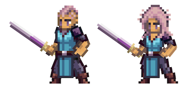

# Warrior

<figure><figcaption></figcaption></figure>

Questa pagina contiene informazioni dettagliate sulle abilità di combattimento della classe Guerriero che verranno utilizzate negli ambienti di combattimento Giocatore-vs-Giocatore (PVP) e Giocatore-vs-Ambiente (PVE).


Tutte le informazioni contenute in questa pagina sono considerate "Pre-Alpha" e preliminari, e sono pertanto soggette a modifiche.

Ultimo aggiornamento: 24/1/2023


## Descrizione della Classe

Il brivido della battaglia, la gloria di una vittoria combattuta e gli oceani di sangue e sudore che ne derivano: il Guerriero vive per il campo di battaglia. Alcuni dicono che i Guerrieri sono i combattenti più feroci del reame, altri dicono che gli dei li hanno dotati di forza e resistenza senza pari, ma più o meno tutti concordano sul fatto che non bisogna mai mettersi contro uno di loro a meno che non sia necessario.

Classe da mischia resistente e potente, il Guerriero eccelle nel combattimento ravvicinato e può adattarsi a diverse situazioni con un’ampia gamma di abilità e capacità. Sono la spina dorsale di ogni gruppo di avventurieri e sono spesso chiamati a guidare la carica in battaglia, anche come mercenari. Sono davvero l’incarnazione della forza e del coraggio, una vera forza contro cui fare i conti.

Che sia nella foga del combattimento o in un tranquillo momento di contemplazione, i tre sentieri del Guerriero richiedono ciascuno la necessità di una crescita e di un miglioramento costanti. Ognuno con la propria identità e il proprio approccio alla gestione del caos della mischia. Ognuno con il proprio modo di iniziare e concludere rapidamente un combattimento.

In primo luogo, il sentiero del **Gladiatore (Gladiator)** è per quei Guerrieri che hanno affinato le loro abilità nella sottile arte di tagliare le cose in due. Il Gladiatore sfrutta la sua notevole forza per sopraffare e schiacciare i nemici con pesanti colpi fisici. Questo percorso si concentra su attacchi aggressivi e potenti a bersaglio singolo e su rotazioni vorticose eseguite in fretta e furia per tagliare le squadre nemiche, lasciando nella loro scia solo distruzione e caos.

In secondo luogo, il **Colosso (Juggernaut)** è un guerriero di poche parole e ancor meno… pensieri. Completamente equipaggiato con uno sguardo sempre pronto a dire “venite a me”, la resistenza e la cruda difesa di un Juggernaut gli permettono di scrollarsi di dosso i colpi più potenti e di diventare addirittura inarrestabile di fronte a un avversario formidabile. L’istinto sfrenato e l’assoluta sfida prendono il sopravvento per mitigare gli attacchi fisici e resistere con facilità a qualsiasi assalto in arrivo, rendendo il Juggernaut un muro di difesa per i suoi alleati che può anche fermare i nemici sul nascere.

Infine, il percorso della **Sete di Sangue (Bloodthirst)** conferisce al Guerriero un significativo danno prolungato di fronte a un nemico stanco. L’ira pura e la furia frenetica aggiungono benzina al fuoco della battaglia, ricompensando questi Guerrieri per la loro eccellente abilità con le lame e l’incrollabile sete di sangue. L’intimidazione, la forza e un pizzico di follia sono sufficienti per giustiziare qualsiasi nemico indebolito, ma non sono mai abbastanza per fermare la mano di questo Guerriero ossessionato dalla battaglia e dal sangue. Il Guerriero assetato di sangue non si arrenderà mai una volta iniziata la battaglia, ma sicuramente si aspetterà che il Guerriero sferri il colpo finale per concluderla.

Attenzione, perché il cammino del Guerriero non è facile. Richiede determinazione e coraggio incrollabili, anche quando si affrontano i nemici più letali. Ma per coloro che sono disposti ad affrontare queste sfide a testa alta, la ricompensa è grande.

## Abilità di Combattimento

| SKILL POINTS | RAGGIO DI AZIONE | TIPO DI COMBO                | ABILITA’           | DoD\* | DURATA  | DESCRIZIONE                                                                                                                                                                                                                                                                                                                                                                                                                              |
| ------------ | ---------------- | ---------------------------- | ------------------ | ----- | ------- | ---------------------------------------------------------------------------------------------------------------------------------------------------------------------------------------------------------------------------------------------------------------------------------------------------------------------------------------------------------------------------------------------------------------------------------------- |
| 1            | -                | Gladiatore (Gladiator)       | Gladiator          | -     | Passiva | Aumento effettivo degli HP del X% in combattimento.                                                                                                                                                                                                                                                                                                                                                                                      |
| 1            | -                | Colosso (Juggernaut)         | Buff               | -     | Passiva | 
Riduce i danni subiti da tutte le fonti di X%.

Riduce i danni inflitti del X%.
                                                                                                                                                                                                                                                                                                                                              |
| 1            | -                | Sete di Sangue (Bloodthirst) | Bloodthirst        | -     | Passiva | Guadagna l'X% di Lifesteal (Ruba vita).                                                                                                                                                                                                                                                                                                                                                                                                  |
| 2            | 1                | Gladiatore (Gladiator)       | Gladiator Strike   | -     | -       | 
Infligge al nemico bersaglio danni fisici pari a (X*Basic + X*STR + X*END).

<strong>COMBO Raffica di lame:</strong> Infligge al nemico bersaglio danni fisici pari a (X*Basic + X*STR + X*END).
                                                                                                                                                                                                                             |
| 2            | -                | Colosso (Juggernaut)         | Ruff               | -     | X       | 
Guadagna X% di Riposte.

Riduce i danni subiti di X% per una durata di X.
                                                                                                                                                                                                                                                                                                                                                    |
| 2            | 3                | Sete di Sangue (Bloodthirst) | War Cry            | X     | X       | 
Infligge danni fisici a tutti i nemici bersaglio pari a (X*Basic).

Intimidisce (Intimidate) tutti i nemici per X%.
                                                                                                                                                                                                                                                                                                          |
| 3            | 3                | Gladiatore (Gladiator)       | Whirlwind          | X     | -       | 
Gira vorticosamente attraverso la squadra nemica.

Infligge danni fisici pari a (X*Basic + X*DEX + X*LCK) a tutti i nemici.
                                                                                                                                                                                                                                                                                                  |
| 3            | -                | Colosso (Juggernaut)         | Gruff              | -     | X       | 
Diventa inarrestabile (unstoppable).

Riduce i danni fisici ricevuti di X%.
                                                                                                                                                                                                                                                                                                                                                  |
| 3            | 1                | Sete di Sangue (Bloodthirst) | Twist the Blade    | -     | X       | 
Infligge al nemico bersaglio danni fisici pari a (X*Basic).

<strong>COMBO Sete di sangue:</strong> L'Eroe bersaglio Sanguina (Bleed) del X% per una durata di X.
                                                                                                                                                                                                                                                            |
| 4            | 1                | Gladiatore (Gladiator)       | Blade Flurry       | X     | -       | Scatena una raffica di Attacchi Base che colpiscono un singolo bersaglio nemico X volte. Ogni colpo infligge danni fisici pari a (X\*Basic).                                                                                                                                                                                                                                                                                             |
| 4            | -                | Colosso (Juggernaut)         | Tuff               | -     | Passiva | Tutti gli attacchi in arrivo hanno una probabilità dell'X% di infliggere a questo Eroe danni ridotti dell'X%, dove X = (X\*END + X\*AGI + X\*FATE).                                                                                                                                                                                                                                                                                      |
| 4            | -                | Sete di Sangue (Bloodthirst) | Unyielding Blade   | -     | -       | 
Infligge danni pari a (X*Basic) al nemico bersaglio.

Se il nemico bersaglio è Stordito (Dazed) , Stordito (Stunned), Silenziato (Silenced) o Accecato (Blinded), infligge invece danni pari a (X*Basic + X*STR).
                                                                                                                                                                                                            |
| 5            | -                | Gladiatore (Gladiator)       | Furious Cleave     | -     | Passiva | 
Gli Attacchi Base di questo Eroe guadagnano Cleave.

Ogni Attacco Base infligge danni pari a (X*Basic) ai nemici in P1 e P2.
                                                                                                                                                                                                                                                                                                 |
| 5            | -                | Colosso (Juggernaut)         | Nuff               | -     | X       | 
Reindirizza l'X% dei danni fisici inflitti dai nemici a questo Eroe.

<strong>COMBO Juggernaut:</strong> Riduce i danni fisici ricevuti di X%.
                                                                                                                                                                                                                                                                               |
| 5            | 1                | Sete di Sangue (Bloodthirst) | Final Blow         | X     | -       | 
Se il nemico bersaglio ha meno dell'X% degli HP massimi, Uccidi (Execute) il bersaglio.

Altrimenti, infligge al nemico bersaglio un danno pari a (X*Basic + X*STR).
                                                                                                                                                                                                                                                         |
| 10+          | 3                | Gladiatore (Gladiator)       | Whirlwind +        | X     | -       | 
Gira vorticosamente attraverso la squadra nemica.

Infligge danni fisici pari a (X*Basic + X*DEX + X*LCK) a tutti i nemici.
                                                                                                                                                                                                                                                                                                  |
| 10+          | 3                | Gladiatore (Gladiator)       | Blade Flurry +     | X     | -       | 
Scatena una raffica di Attacchi Base che colpiscono un singolo bersaglio nemico X volte.

Ogni colpo infligge danni pari a (X*Basic).

X% di probabilità di infliggere uno stordimento (Daze) per ogni colpo.
                                                                                                                                                                                                           |
| 10+          | -                | Colosso (Juggernaut)         | Gruff +            | -     | X       | 
Diventa inarrestabile (Unstoppable).

Riduce i danni fisici ricevuti di X%.
                                                                                                                                                                                                                                                                                                                                                  |
| 10+          | -                | Colosso (Juggernaut)         | Tuff +             | -     | Passiva | Guadagna Blocco (Block) pari a +X%, dove X = (X\*END + X\*DEX + X\*AGI + X\*LCK).                                                                                                                                                                                                                                                                                                                                                        |
| 10+          | 3                | Sete di Sangue (Bloodthirst) | War Cry +          | X     | X       | 
Infligge danni fisici a tutti i nemici bersaglio pari a (X*Basic).

Intimidisce (Intimidate) tutti i nemici per X%.
                                                                                                                                                                                                                                                                                                          |
| 10+          | 1                | Sete di Sangue (Bloodthirst) | Unyielding Blade + | -     | -       | 
Infligge danni pari a (X*Basic) al nemico bersaglio.

Se il nemico bersaglio è Stordito (Dazed) , Stordito (Stunned), Silenziato (Silenced) o Accecato (Blinded), infligge invece danni pari a (X*Basic + X*STR).
                                                                                                                                                                                                            |
| 10           | -                | Gladiatore (Gladiator)       | Adrenaline Rush    | -     | Passiva | Se questo Eroe ha subito danni nell'ultimo turno, aumenta i danni dell'Attacco Base di X% in questo turno.                                                                                                                                                                                                                                                                                                                               |
| 10           | 1                | Gladiatore (Gladiator)       | Mighty Strike      | -     | -       | 
 Infligge al bersaglio un danno pari a (X*Basic).

Stordisce (Daze) il nemico bersaglio.

<strong>COMBO Colpo del Gladiatore il turno prima, Raffica di Lame il turno prima:</strong> Infligge al bersaglio danni pari a (X*Basic + X*STR).
                                                                                                                                                                             |
| 10           | -                | Gladiatore (Gladiator)       | Battleforged       | -     | -       | Attivare per ottenere una barriera pari all'X% degli HP massimi.                                                                                                                                                                                                                                                                                                                                                                         |
| 10           | 3                | Gladiatore (Gladiator)       | Highlander         | -     | -       | 
Bersaglia il Warrior nemico, sfidandolo in un duello 1v1.

Entrambi i Guerrieri sferrano attacchi base alternati e rapidi finché uno dei due non muore.
                                                                                                                                                                                                                                                                      |
| 10           | 1                | Colosso (Juggernaut)         | Cuff               | -     | -       | 
Infligge al bersaglio danni pari a (X*Basic).

Stordisce (Stun) il bersaglio.
                                                                                                                                                                                                                                                                                                                                                |
| 10           | 3                | Colosso (Juggernaut)         | Slam               | X     | -       | 
Infligge a tutti i nemici danni pari a (X*Basic).

X% di probabilità di infliggere Stordimento (Daze) ai colpi.

X% di probabilità di infliggere Stordimento (Stun) ai colpi.

<strong>COMBO Juggernaut:</strong> infligge un X% di Rallentamento (Slow) ai colpi per una durata di X.
                                                                                                                             |
| 10           | 3                | Colosso (Juggernaut)         | Spin               | X     | -       | 
Infligge a tutti i nemici danni pari a (X*Basic + X*STR + X*END + X*DEX).

X% di possibilità di Spingere (Push) P1 verso P2.

X% di possibilità di Tirare (Pull) P3 a P2.

X% di possibilità di infliggere uno Stordimento (Daze) al colpo.

X% di possibilità di Silenziare (Silence) quando colpisce.

X% di possibilità di infliggere Stordimento (Stun) ai colpi.

Diventa Esausto (Exhausted).
 |
| 10           | -                | Sete di Sangue (Bloodthirst) | Fury               | -     | Passiva | 
Ogni volta che questo Eroe infligge danni da Attacco Base, guadagna X Furia.

Con X Pile (Stack) di Furia, il prossimo Attacco Base di questo Eroe infligge danni pari a (X*Basic).
                                                                                                                                                                                                                                          |
| 10           | -                | Sete di Sangue (Bloodthirst) | Defiance           | -     | X       | Guadagno X% Riposte.                                                                                                                                                                                                                                                                                                                                                                                                                     |
| 15+          | -                | Sete di Sangue (Bloodthirst) | Way of the Warrior | -     | X       | 
Guarisce istantaneamente per l'X% degli HP mancanti.

Riduce i danni fisici subiti del X% per una durata di X.

Il prossimo danno letale subito da questo Eroe viene evitato, ma i suoi HP si riducono a X.
                                                                                                                                                                                                             |

### Note 

* DoD\*: Grado di Difficoltà (Degree of Difficulty)
* Le abilità da 10+ punti costano 10 meno il costo della versione base dell’abilità.
* Le abilità da 15 punti sono disponibili solo per gli Eroi con una classe/sottoclasse corrispondente.
