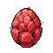

# Dark Summoning

Il **Dark Summoning** consente ai giocatori di sacrificare due Eroi per evocarne uno nuovo. Ci sono costi e restrizioni ridotti sull'evocazione e, in cambio, vantaggi per il nuovo Eroe.

> _"Che cosa abbiamo qui? Hrrgh... Un volto nuovo. Sìss... e là, dietro gli occhi, un'oscurità... che si fa sempre più profonda. Vieni, giovane, stai con me e guarda nel vuoto. C'è dolore là, siss... ma anche grande potenza."_

<figure><figcaption></figcaption></figure>

## Meccaniche

\
L'Evocazione Oscura funziona come l'Evocazione standard, in cui due Eroi possono creare un nuovo Eroe. La genetica dell'Eroe e le evocazioni rimanenti vengono tramandate allo stesso modo. I giocatori possono usare [Enhancement Stones](../../../learn/gameplay/heroes/enhancement-stones.md) ed infondere la nuova evocazione con Gaia's Tears per ricevere bonus statistici.

Tuttavia, ci sono alcune differenze chiave rispetto all'evocazione standard:

### Burning degli Eroi


A differenza dell'evocazione standard, nel Dark Summoning i due Eroi evocatori vengono sacrificati (bruciati) ed inviati permanentemente ad un portafogli chiamato Cimitero. Questa azione non può essere annullata.


### Costi di Summoning ridotti

Il Dark Summoning costa 1/4 della quantità di CRYSTAL necessaria nell'Evocazione standard.

### Restrizioni Ridotte

* Gli Eroi con zero evocazioni rimanenti possono essere sacrificati nel Dark Summoning. Qualsiasi Eroe risultante avrà zero evocazioni (anche nel caso di una mutazione di Classe Eroe).
* Non ci sono restrizioni sull'evocazione oscura di Eroi che condividono un'origine comune.
* Il tempo di recupero dell'evocazione sugli Eroi viene ignorato durante l'Evocazione Oscura.

### Restrizioni Aggiuntive

* Gli Eroi Gen0 non sono idonei per l'evocazione oscura.
* Gli eroi listati per essere assoldati nella [Taverna](../../../learn/gameplay/tavern.md) non possono essere usati nel Dark Summoning. I giocatori devono possedere entrambi gli Eroi evocanti.

## Benefits per l'Eroe

In cambio del sacrificio degli Eroi evocatori, gli Eroi evocati attraverso il Dark Summoning ricevono i seguenti vantaggi:

### Trasmissione del Livello

Gli Eroi evocati attraverso il Dark Summoning possono [salire immediatamente di livello](../../../learn/gameplay/heroes/leveling.md) fino al livello medio dei due Eroi evocatori (arrotondato per difetto). Non sono necessari XP per questi passaggi di livello e gli XP guadagnati non verranno trasferiti. Gli aumenti di livello vengono effettuati individualmente ed i giocatori possono scegliere le statistiche per la benedizione di Gaia ed utilizzare gli [Attunement Crystals](../../../learn/gameplay/heroes/attunement-crystal/) durante ciascuno di essi.

### Rarità

Le probabilità di rarità di base per gli Eroi evocati attraverso il Dark Summoning sono aumentate rispetto alle Evocazioni standard, come segue:

<figure><figcaption>
Probabilità di rarità base per gli Eroi Evocati attraverso il Dark Suummoning
</figcaption></figure>

#### Floor di Rarità

La rarità più bassa possibile quando si utilizza il Dark Summoning si basa sulla rarità media dei due Eroi sacrificati (arrotondata per difetto). La rarità floor non aumenta le possibilità di ottenere rarità più elevate, garantisce semplicemente che l'Eroe evocato non sarà di una rarità inferiore rispetto alla media dei due Eroi sacrificati.


Esempio: un Eroe Common abbinato ad un Eroe Rare avrebbe una rarità di base Uncommon, ed allo stesso modo per un Common abbinato ad un Legendary.


#### Sovraccarico di Rarità

I giocatori possono spendere CRYSTAL ed Gaia's Tears extra per aumentare le possibilità di ottenere Eroi di rarità superiore. L'importo extra che può essere pagato si basa sulla somma delle evocazioni rimanenti dei due Eroi evocatori. Per ogni evocazione rimanente, i giocatori possono pagare 0,625 CRYSTAL e 20 Gaia's Tears per ricevere 1/5 del bonus che si ottiene evocando con un Eroe più raro. Quindi, ad esempio, se hanno 20 evocazioni rimanenti, sarebbe come se entrambi gli Eroi fossero due livelli di rarità più alti di quanto non siano in realtà.


Il sovraccarico di rarità non influisce sul numero di evocazioni che il nuovo Eroe avrà.


#### Calcoli Rarità

I calcoli per la rarità dal Dark Summoning sono i seguenti:

**`rareMod`** = la somma dei valori di rarità dei due Eroi. Common ha un valore di rarità di 0 ed ogni incremento di rarità aumenta il valore di 1, quindi Mythic ha un valore di rarità di 4.&#x20;

**`chargeValue`** = questo valore rappresenta il numero di evocazioni rimanenti degli Eroi sacrificati che i giocatori pagano in più per sovraccaricare la rarità. Questo valore può variare da 0 a 20 a seconda dei due Eroi sacrificati.

* `Common = 527000 - 34250`_`rareMod - 6850`_`chargeValue`
* `Uncommon = 300000 + 10250`_`rareMod + 2050`_`chargeValue`
* `Rare = 140000 + 9375`_`rareMod + 1875`_`chargeValue`
* `Legendary = 30000 + 8500`_`rareMod + 1700`_`chargeValue`
* `Mythic = 3000 + 6125`_`rareMod + 1225`_`chargeValue Dividi questi valori per 10000 per trovare la percentuale finale.`

Dividi questi valori per `10000` per trovare la percentuale finale.

### Shiny - Brillante

La possibilità di ricevere un Eroe [Shiny](../../../learn/gameplay/heroes/rarity.md#shiny-brillante) è aumentata di 5 volte rispetto all'Evocazione standard.
