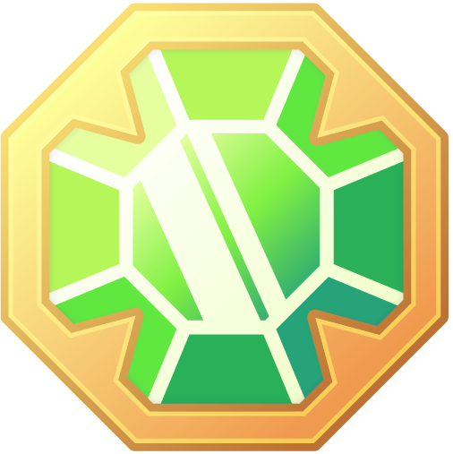

# FAQ

## GENERALI

### Cos'è DeFi Kingdoms?

DeFi Kingdoms (DFK) è un gioco, uno Exchange decentralizzato (DEX), un'opportunità in pool di liquidità (LP), ed un mercato di rari NFT basati su utility, tutto si svolge perfettamente nella forma incredibilmente nostalgica della pixel art fantasy.

DFK Serendale è stato lanciato su Harmony il 22 Agosto 2021 come DEX con opportunità di farming LP ed è in costante sviluppo.

DeFi Kingdoms: Crystalvale è stato lanciato il 30 Marzo, 2022. Questa è la prima espansione di DeFi Kingdoms e sarà live sulla nuova DFK Chain.



### Che Blockchain utilizza DeFi Kingdoms?

DeFi Kingdoms utilizza la blockchain del protocollo Harmony e la sua moneta nativa ONE. ONE può essere acquistata sulla maggior parte dei principali exchange, inclusi Binance, Kucoin, Crypto.com e altri.

La Blockchain DeFi Kingdoms verrà lanciata il 30 Marzo, 2022 e dospiterà la prima espansione del gioco, chiamata  DeFi Kingdoms: Crystalvale. Sarà disponibile un bridge in-game tra le blockchain.

Per informazioni su come configurare il tuo portafoglio MetaMask, fai riferimento al nostro [tutorial](https://defikingdoms.com/tutorial.html) o alla documentazione di [Harmony](https://docs.harmony.one/home/network/wallets/browser-extensions-wallets/metamask-wallet).

### Che cos'è DeFi e che cos'è un Exchange Decentralizzato (DEX)?

DeFi, o Decentralized Finance, è un ecosistema di applicazioni finanziarie costruito su reti blockchain che mira a fornire servizi finanziari senza un'autorità centralizzata.

Uno exchange decentralizzato, o DEX, consente agli utenti di scambiare fondi tramite smart contracts senza rinunciare alla custodia fino al completamento dello scambio. La liquidità viene fornita ai DEX da individui che forniscono una coppia di token (ad es. ONE e JEWEL) a un pool di liquidità, che viene quindi utilizzata dal DEX per facilitare le negoziazioni su quella coppia.

Gli utenti che forniscono liquidità in questo modo ricevono gettoni Liquidity Pool (LP), che spesso possono essere utilizzati per guadagnare premi aggiuntivi, come nei [DFK's Gardens](../come-funziona-defi-kingdoms/the-gardens/).

Puoi leggere di più sulla [finanza decentralizzata](https://academy.binance.com/it/articles/the-complete-beginners-guide-to-decentralized-finance-defi) e gli [scambi decentralizzati](https://academy.binance.com/it/articles/what-is-a-decentralized-exchange-dex) su Binance Academy.

### Quanto costa cominciare a giocare?

Il gioco in se è gratuito, tuttavia c'è un costo di transazione (gas) ogni volta che interagisci con la blockchain, come quando crei un profilo entrando nel gioco. Grazie alle commissioni molto basse di Harmony, queste sono una frazione di centesimo.

Una volta che sei nel gioco, puoi spendere quanto vuoi, tanto o poco, aggiungendo alle riserve di liquidità nel Marketplace e depositando token LP nei [Gardens](../come-funziona-defi-kingdoms/the-gardens/) o JEWEL dal [Jeweler](../gameplay/zone-di-gioco/bank.md).

Puoi anche spendere JEWEL per acquistare [Eroi NFT](gameplay/heroes/) nella [Tavern](../gameplay/zone-di-gioco/tavern.md). Gli Eroi possono essere usati per raccogliere risorse attraverso le loro [Professions](gameplay/professions/) e possono essere accoppiati ad altri Eroi per [Evocare](gameplay/heroes/summoning.md) nuovi Eroi dal [Portal](../gameplay/zone-di-gioco/portal.md).

## TOKEN DEL POTERE

### Come posso acquistare JEWEL?

Dopo aver effettuato l'accesso a [https://game.defikingdoms.com/](https://game.defikingdoms.com/#/) potrai acquistare JEWEL al [Marketplace](../gameplay/zone-di-gioco/marketplace.md) dal commerciante, il Trader Matoya. Potrai scambiare i tuoi ONE, o la maggior parte degli altri token di Harmony.

Il contratto di JEWEL su Harmony è: `0x72Cb10C6bfA5624dD07Ef608027E366bd690048F`

### Come posso acquistare `CRYSTAL`?

CRYSTAL può essere acquistato in-game su Crystalvale al Marketplace.

### Dove posso trovare il prezzo corrente / market cap di JEWEL o CRYSTAL?

Puoi vedere il prezzo attuale e la capitalizzazione di mercato di JEWEL o CRYSTAL nel  gioco facendo clic sull'immagine del tuo profilo in alto a sinistra.

### Cosa posso fare con i miei JEWEL?

JEWEL è la linfa vitale dell'economia DFK e la maggior parte delle azioni di gioco implicano la ricezione o la spesa di JEWEL, sia che si tratti di acquistare/vendere Eroi, guadagnare tramite Quests, [fornire liquidità al DEX](../come-funziona-defi-kingdoms/decentralized-exchange.md) e [farmare nei giardini](../come-funziona-defi-kingdoms/the-gardens/) o depositare nel caveau del Jeweler.

[Qui](../come-funziona-defi-kingdoms/i-token-del-potere/jewel-token.md) puoi leggere di più sul token JEWEL e la sua tokenomic.

## GIOCO & MECCANICHE DEX

### Qual'è la differenza tra Jeweler e Gardens?

Il [Jeweler](../gameplay/zone-di-gioco/bank.md) è una pool a partecipazione unica per JEWEL o CRYSTAL. Quando depositi i tuoi JEWEL o CRYSTAL dal Jeweler, ricevi un importo proporzionale di xJEWEL o xCRYSTAL. Poiché il rapporto tra loro non fa che aumentare, quando prelevi dal Jeweler riceverai sempre più JEWEL o CRYSTAL di quelli che hai messo!

I [Gardens](../come-funziona-defi-kingdoms/the-gardens/) ti consentono di mettere in stake i token Liquidity Pool (LP) che ricevi fornendo liquidità al DEX. Riceverai un ritorno in JEWEL o CRYSTAL in cambio dello staking di questi token.

Sebbene i Gardens forniscano rendimenti più elevati rispetto al Jeweler, ciò comporta un rischio maggiore, inclusa l'Impermanent Loss (IL) se il valore dei token nella coppia cambia l'uno rispetto all'altro. Puoi saperne di più sulla perdita temporanea da [Binance Academy](https://academy.binance.com/it/articles/impermanent-loss-explained) o [guardando questo video.](https://www.youtube.com/watch?v=qkaBCIpvfIg\&t=1297s)

### Qual'è la differenza tra JEWEL/CRYSTAL e xJEWEL/xCRYSTAL?

JEWEL e CRYSTAL sono i token principali di DFK, utilizzati per molte transazioni in-game. Quando li depositi dal Jeweler, ricevi la versione "x", che è il token di governance di DFK. Tenere xJEWEL o xCRYSTAL ti rende anche idoneo a ricevere airdrop per la Community ed altri premi.

### Quanto è l'APR / tasso di interesse del Jeweler?

Poiché i guadagni del Jeweler derivano dalle commissioni di trading che si verificano all'interno del gioco, non è previsto alcun APR o tasso di interesse. Durante i periodi di grande attività di gioco, il rapporto tra JEWEL ed xJEWEL o tra CRYSTAL e xCRYSTAL aumenterà un po', mentre è rallentato in altri momenti.

### Perchè alcuni dei miei token JEWEL sono bloccati?

Al fine di garantire la stabilità di JEWEL o CRYSTAL nel lungo termine, una parte dei tokens JEWEL guadagnati nei Gardens sono temporaneamente bloccati e non possono essere utilizzati in alcun modo. Questi JEWEL bloccati verranno lentamente sbloccati a partire dall'Epoch 51 (stima nel terzo trimestre del 2022). Il processo di sblocco può essere accelerato tramite le missioni di Mining. Scopri di più sulla tokenomics di DFK [qui](../come-funziona-defi-kingdoms/the-gardens/).

### Quanto è lunga un'Epoch?

Un' Epoca su Serendale è di 302.400 blocchi della blockchain di Harmony, e la lunghezza di ciascuna Epoca dipende dalla velocità media di elaborazione dei blocchi su Harmony. Le Epoche sono state calcolate a 302.400 blocchi in modo che ognuna equivalesse ad una settimana, ad una velocità di 2 secondi per blocco (non fissa).

Le Epoche su Crystalvale sono esattamente di una settimana e sono gestite con dei timestamp.

### Perchè le ricompense nei miei giardini vengono riscattate?

I guadagni dei Gardens vengono automaticamente accreditati ogni volta che depositi o prelevi tokens LP nei [Gardens](../come-funziona-defi-kingdoms/the-gardens/).

### Quando inizia / si azzera il sistema di commissioni dei giardini?

Il [programma delle commissioni di prelievo](../come-funziona-defi-kingdoms/the-gardens/#commissioni-di-deposito-e-prelievo-di-ritiro-dai-gardens) per i Gardens inizia quando depositi per la prima volta i tuoi token LP in un giardino specifico, ed è separato per ogni giardino. Le commissioni si azzerano ogni volta che prelevi token LP da un giardino.

## EROI & EVOCAZIONI

### Che cosa può fare un Eroe? Me ne serve uno?

Gli Eroi sono fondamentali per il gameplay in DeFi Kingdoms. Possono Evocare nuovi Eroi, essere inviati in missioni, impegnarsi in professioni ed infine combattersi tra loro in PVP. Anche se puoi usare il DEX, i Gardens ed il Jeweler senza un Eroe, pensiamo che tutti apprezzeranno le opportunità che hanno da offrire!

Leggi di più riguardo gli Eroi [qui](../come-funziona-defi-kingdoms/the-heroes.md).

### Dove posso acquisire un Eroe?

Gli Eroi possono essere acquistati da altri giocatori nella [Tavern](../gameplay/zone-di-gioco/tavern.md) e possono anche essere noleggiati dal [Portal](../gameplay/zone-di-gioco/portal.md), per assistere nel processo di [Evocazione](gameplay/heroes/summoning.md).

### Qual'è la differenza tra Eroi Gen0 e Generazioni successive?

Gli Eroi Gen0 sono i creatori di tutti gli altri Eroi del gioco e, in quanto tali, sono presenti in numero limitato e rari, questo li rendi anche altamente collezionabili. Poiché sono responsabili della semina dei geni a tutti gli altri Eroi, gli Eroi Gen0 non hanno un limite al numero di volte che possono evocare.

### Ci saranno altre vendite di Eroi Gen0?

La vendita degli Eroi Gen0 è avvenuta il 30 Settembre e tutti i 2000 Eroi sono andati esauriti in 11 minuti! Poiché questi Eroi sono NFT collezionabili unici, non ci sarà un'altra vendita di Eroi Gen0 come quella passata.

Tuttavia, poiché gli Eroi Gen0 sono l'unico modo per seminare nuovi geni nella Pool Genetica degli Eroi, man mano che DFK si espande a nuovi Regni e blockchain, potremmo eventualmente vendere altri Eroi Gen0 in futuro per introdurre nuove Classi o altre caratteristiche per gli Eroi nel gioco. Questo sarà fatto con attenzione per non diluire il valore degli Eroi Gen0 esistenti.

### Come evoco un nuovo Eroe?

Se hai due Eroi, puoi andare al Portal ed evocarne un altro. Avrai bisogno di alcuni JEWEL ed almeno 20 Gaia's Tears.

Se hai un solo Eroe, puoi noleggiarne uno da un altro giocatore per assisterlo nel processo di Evocazione.

Leggi di più sule Evocazioni [qui](gameplay/heroes/summoning.md).

### Dove posso ottenere le Gaia's Tears per evocare un nuovo Eroe?

Le Gaia's Tears sono disponibili come bottino dalle [Profession Quests](gameplay/professions/). La [Pesca](gameplay/professions/fishing.md), la [Raccolta](gameplay/professions/foraging.md), il [Giardinaggio](gameplay/professions/gardening.md) e l'Estrazione Mineraria ([Gold](gameplay/professions/gold-mining.md) e [JEWEL](gameplay/professions/jewel-mining.md)), tutte hanno la possibilità di ricompensare con Gaia's Tears.

Inoltre, le Gaia's Tears possono essere guadagnate nella mini-quest del Pozzo dei Desideri (Whishing Well), a cui è possibile accedere vicino al Castello nella schermata della mappa del mondo o all'interno della zona del Circolo di Meditazione (Meditation Circle). Se possiedi un Eroe, puoi inviarlo in una missione del Pozzo dei Desideri, che esaurirà la sua Stamina e ti darà la possibilità di ricevere alcune Gaia's Tears. C'è la possibilità di non ricevere Tears per la missione.

Alcuni giocatori hanno aggiunto le loro Gaia's Tears (DFKTEARS) ad una Pool di Liquidità (JEWEL-DFKTEARS) nel Marketplace.

### Non ho ricevuto il nuovo Eroe dopo l'Evocazione!

Dopo aver infuso un Cristallo con l'essenza di due Eroi, deve essere portato al Portale di Evocazione per richiamare l'eroe dai meandri del Bosco Interno.

Se non vedi il Cristallo Infuso dopo che la transazione di Evocazione è andata a buon fine, prova ad aggiornare la pagina ed aprire MetaMask per alcuni secondi (preferibilmente nella schermata delle risorse). Potrebbe essere necessario provare più volte, ma questo dovrebbe permetterti di visualizzare il Cristallo Infuso.

## STATS EROI, QUESTS, E PROFESSIONI

### Quali sono le diverse Rarità e che cosa comportano?

Gli Eroi evocati possono essere delle seguenti [Rarità](gameplay/heroes/rarity.md), indicate dal colore del bordo della carta:

* **Mythic (Viola)**
* **Legendary (Arancione)**
* **Rare (Blu)**
* **Uncommon (Verde)**
* **Common (Grigio)**

Gli Eroi di Rarità superiore vengono evocati con valori delle [Statistiche](gameplay/heroes/stats.md) aumentati. Anche gli Eroi rari o superiori ricevono bonus aggiuntivi alle Stats ogni 5 livelli.

### Come posso sapere se il mio Eroe è forte?

Pensiamo che ogni Eroe sia prezioso! Ma diverse Classi di Eroi e combinazioni di Statistiche possono essere più utili a determinate attività, siano esse particolari Quests, Professions o PVP. Controlla se le Statistiche potenziate del tuo Eroe (in verde, blu o viola) sono in linea con la Profession scelta (in verde) o con le [Statistiche associate alla sua Classe/Cottoclasse](https://docs.google.com/spreadsheets/d/1jfG6E6otW1V6ZLQycF5DumoBr\_LrpQaz7cTmDPpwV2s/edit#gid=2115998520)

Alcune Classi, Professioni, Rarità e Caratteristiche visive possono anche essere più desiderabili per i giocatori a seconda del loro stile di gioco.

### Cosa sono le Stats Verdi/Blu/Viola del mio Eroe?

I geni di ogni Eroe danno un aiuto a due Statistiche e lo rendono naturalmente incline ad una Professione. I geni delle Statistiche sono mostrati in **verde** e **blu** sul retro della carta Eroe. Se i due geni sono entrambi per la stessa Statistica, verrà mostrato in **viola**.

Esistono due tipi di geni delle Statistiche, ed ogni Eroe ne ha uno per ciascuno:

* Un bonus una tantum +2 a quella Statistica (**verde**)
* Un bonus continuo del +2% al valore di crescita primaria della Statistica dell'Eroe, ed un bonus del +4% al suo valore di crescita secondario della Statistica dell'Eroe (**blu**). Questi valori aumentano la probabilità che le Statistiche aumentino quando l'Eroe sale di livello.

Gli Eroi riceveranno un bonus quando effettuano Profession Quests che corrispondono al loro gene della Professione (**verde**).

### Come funzionano le Professioni?

Per gli Eroi, sono disponibili quattro diverse [Professions](gameplay/professions/): Gardening, Mining, Fishing e Foraging. Ogni Professione ha un'abilità (skill) ad essa associata che ha la possibilità di aumentare ogni volta che un Eroe esegue una missione di Professione associata. Man mano che queste abilità aumenteranno, aumenterà anche la capacità dell'Eroe di guadagnare ricompense da quella Professione. Inoltre, ciascuna di queste Professioni ha un gene ad essa associato (in **verde** sulla tua carta Eroe). Gli Eroi ricevono vantaggi aggiuntivi quando svolgono missioni di Professione che corrispondono al loro gene di Professione.

Impegnarsi in una Profession Quest consuma la Stamina del tuo Eroe. Il Mining ed il Gardening drenano la Stamina ad una velocità fissa di 10 minuti, come indicato nel menu delle Quests. Questo consente all'Eroe di svolgere queste missioni per periodi di tempo più lunghi, fino a quando non esaurisce la sua Stamina o fino a quando la missione non viene interrotta manualmente. Le missioni di Foraging e Fishing sono più brevi e consumano una maggiore quantità di Stamina per una durata minima, come mostrato nel menu delle Quests. Le missioni di Fishing e Foraging ti consentono di mettere in coda più tentativi di missioni in una transazione, fino all'importo massimo consentito dalla Stamina del tuo Eroe (in base al consumo di Stamina dato dalla presenza o meno del gene di Professione). Gli Eroi recuperano Stamina ad una velocità fissa di 1 ogni 20 minuti.\
**Nota: gli Eroi non possono recuperare Stamina mentre sono impegnati in una missione.**

## KINGDOMS / LANDS

### Cosa sono i Lotti di terreno?

I Regni, o Lotti, sono un ulteriore tipo di NFT limitato in quantità ed altamente collezionabile. Man mano che la mappa del mondo verrà rivelata, i giocatori potranno acquistare Lotti di terreno dove potranno essere costruiti Edifici, e dove potranno aver luogo transazioni e missioni. I proprietari terrieri riceveranno una parte delle entrate generate dai loro Lotti!

### Come posso acquistare un Lotto o partecipare all'airdrop?

25 Kingdom Plots sono stati assegnati a vincitori casuali il 26 Novembre 2021, persone che possedevano almeno 5.000 xJEWEL nel proprio conto dal Jeweler entro il 13 Novembre 2021 (per ogni 5000 xJEWEL aggiuntivi che un giocatore aveva dal Jeweler, ha ricevuto 2 tickets extra nell'estrazione di vincitori casuali.)

Altri 25 Kingdom Plots sono stai assegnati a vincitori casuali il 26 Novembre 2021, persone che possedevano almeno 1.000 xJEWEL nel proprio conto presso il Jeweler entro il 13 Novembre 2021. Ulteriori Snapshots sono stati effettuati ogni 8-12 ore per 4 settimane, fino all'11 Dicembre 2021. Il numero totale di iscrizioni sarà determinato dalla quantità media di xJEWEL in tutti gli Snapshot, per tutti i titolari che si sono qualificati durante lo Snapshot iniziale. (Per ogni 1.000 xJEWEL in più che un giocatore aveva dal Jeweler, riceverà 2 tickets extra.)

Le Lands saranno disponibili per l'acquisto in futuro. Il modo più affidabile per prepararsi all'acquisizione di terre è rendere i tuoi Eroi il più potenti possibile, ma i meccanismi per acquisire i singoli lotti possono variare.

## VARIE

### DeFi Kindoms ha passato Verifiche di Sicurezza?

Sì, un Audit di [Solidity.Finance](https://solidity.finance/audits/DefiKingdoms/) è già stato completato. Il team si impegna a garantire la sicurezza e la stabilità del progetto e sono in corso ulteriori [Audit](../important/audit-results.md).

### Il team di sviluppo è doxxed (nomi reali rivelati)?

Il Team non è attualmente doxxato per motivi personali anche se molti di loro vorrebbero farlo in futuro. Alcuni di loro lo sono con i volti in quanto DeFi Kingdoms ha già partecipato a diverse conferences globali come [BitBasel](https://twitter.com/bitbaselmiami), [DCentralCon](https://twitter.com/DcentralCon) ([foto di gruppo ;)](https://twitter.com/AbrahamOne4all/status/1466435426395246598)),e tante altre. Ti incoraggiamo a visualizzare il nostro [track record di sviluppo](broken-reference) ed impegno per il progetto, ad esaminare l'[Audit dello Smart Contract](../important/audit-results.md), a partecipare agli AMA settimanali dei vari reparti del Team (lunedì alle 20:00 CEST (Roma) sul nostro server [Discord](https://discord.gg/defikingdoms) e, naturalmente, a [DYOR](../important/dyor-disclaimer.md).
