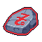

# Jeweler

La zona **Jeweler** permette ai giocatori di [depositare i tokens JEWEL](../../come-funziona-defi-kingdoms/il-jeweler/) per ottenere ricompense attraverso la distribuzione delle quote. È anche il luogo in cui gestire i gettoni di potere bloccati, reclamare i gettoni JEWEL e i gettoni di potere sbloccati e gestire i [Power-Up.](../../come-funziona-defi-kingdoms/il-jeweler/power-ups.md)

I seguenti NPC interagibili sono disponibili nella zona del Jeweler in ogni regno:

### Crystalvale

<table><thead><tr><th width="116.33333333333331"> </th><th width="236">Name</th><th>Function(s)</th></tr></thead><tbody><tr><td></td><td><strong>Thorstein Silvertongue</strong> Welcome</td><td><ul><li>Informazioni su NPC degni di nota</li><li>Link a questi Documenti</li></ul></td></tr><tr><td></td><td><strong>Soren the Tall</strong> Jeweler</td><td><ul><li><a href="bank.md">Stake JEWEL</a> &#x26; Reclamo Rewards</li><li>Reclamo <a href="../../come-funziona-defi-kingdoms/i-token-del-potere/jewel-token.md#vesting-jewel">Vesting JEWEL</a></li><li>Reclamo <a href="../../come-funziona-defi-kingdoms/i-token-del-potere/crystal-token.md#allocazione-dei-tokens">Locked CRYSTAL</a></li><li><a href="../../come-funziona-defi-kingdoms/the-gardens/ice-gardens.md#meccanismo-di-blocco">Sblocco CRYSTAL</a></li><li>Gestione xCRYSTAL (<a href="../../come-funziona-defi-kingdoms/il-jeweler/#jeweler-1.0">Jeweler 1.0</a>)</li></ul></td></tr><tr><td></td><td>
<strong>Dorarulir Gemmaster</strong>

Manager
</td><td><ul><li><a href="../../come-funziona-defi-kingdoms/the-gardens/ice-gardens.md#transferimento-dei-crystal-bloccati">Trasferimento locked CRYSTAL</a></li><li>Autorizzazione Trasferimento locked CRYSTAL</li></ul></td></tr><tr><td></td><td><strong>Durnan Gearspinner</strong> Power-Ups</td><td><ul><li>Gestione <a href="../../come-funziona-defi-kingdoms/il-jeweler/power-ups.md">Power-Up</a></li></ul></td></tr><tr><td></td><td><strong>Lemira</strong> Tafl Match</td><td><ul><li>Inizio e Completamento "Tafl Match" (INT) <a href="training-quests.md">Missione di Addestramento</a></li></ul></td></tr></tbody></table>

### Serendale

<table><thead><tr><th width="116.33333333333331"> </th><th width="236">Name</th><th>Function(s)</th></tr></thead><tbody><tr><td></td><td><strong>Jeweler Micah</strong> Welcome</td><td><ul><li>Informazioni su NPC degni di nota</li><li>Link a questi Documenti</li></ul></td></tr><tr><td></td><td><strong>Jeweler Ian</strong> Jeweler</td><td><ul><li><a href="broken-reference">Stake JEWEL</a> &#x26; Reclamo rewards</li><li>Reclamo <a href="broken-reference">Liquid JADE</a></li><li>Reclamo <a href="broken-reference">Vesting JADE</a></li><li>Reclamo <a href="broken-reference">Locked JADE</a></li><li>Sblocco JADE</li></ul></td></tr><tr><td></td><td>
<strong>Manager Greg</strong>

Manager
</td><td><ul><li>Transfer locked JADE to another wallet</li><li>Allow incoming locked JADE transfer</li></ul></td></tr><tr><td></td><td><strong>Wizzle von Sniksnak</strong> Power-Ups</td><td><ul><li>Gestione <a href="../../come-funziona-defi-kingdoms/il-jeweler/power-ups.md">Power-Up</a></li></ul></td></tr></tbody></table>
