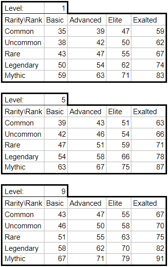
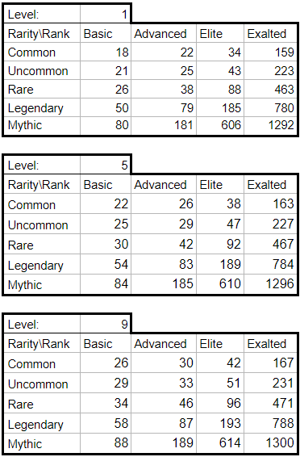
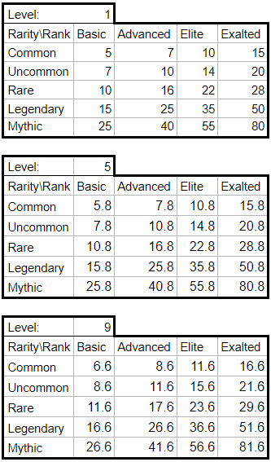
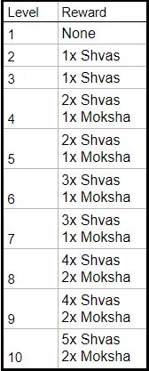
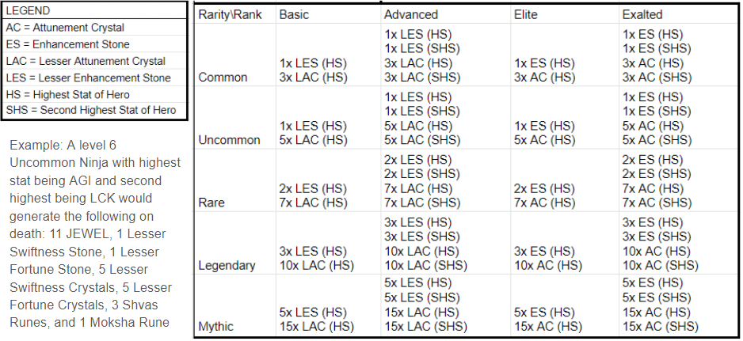

# The Perilous Journey

The Perilous Journey è una quest opzionale in cui i giocatori possono inviare i loro Eroi in attesa dell'annuncio di DeFi Kingdoms: Crystalvale.

Questa quest è progettata per essere incredibilmente rischiosa per gli Eroi.. molti verranno bruciati. "Bruciare" significa che gli Eroi vengono spostati in un portafoglio inaccessibile; saranno morti a tutti gli effetti. A questo proposito, vogliamo che i giocatori stiano molto attenti alla loro decisione di mettere a rischio i loro Eroi, e che abbiamo completamente chiari i rischi e la struttura delle ricompense. Una volta che gli Eroi sono impegnati nel viaggio, **non possono essere rimossi**. Gli Eroi **saranno inaccessibili** dal momento in cui saranno impegnati, fino al 16 Marzo 2022 alle 20:00, quando il Viaggio sarà completo.

Questa quest non comporta nessun utilizzo di bridges. Tutte le ricompense tranne CRYSTAL, verranno distribuite a Serendale su Harmony, dove tutti gli Eroi sopravvissuti torneranno al termine del Viaggio. Le ricompense CRYSTAL saranno distribuite in Crystalvale, quindi saranno inaccessibili fino al lancio di DeFi Kingdoms: Crystalvale. A quel punto, una meccanica in-game assisterà nella configurazione RPC, consentirà ai giocatori di accedere all'espansione , fare bridge di JEWEL se lo desiderano ed accedere alle loro ricompense.

Il 28 Febbraio 2022 durante l'AMA settimanale è stato annunciato un aumento del numero di Eroi Gen0 assegnati alle due lotterie.

**Le informazioni che seguono sono uno sguardo approfondito sulle formule alla base della sopravvivenza e delle ricompense. Tuttavia, sarà possibile visualizzare l'esatta possibilità di sopravvivenza e le potenziali ricompense per ciascuno dei tuoi Eroi quando si interagirà con l'NPC per partecipare alla quest.**

### **Date ed Orari**

* Il Journey sarà disponibile il 2 Marzo 2022, in occasione della patch settimanale
* La registrazione al Journey chiude il 7 Marzo 2022 alle 20:00
* Il Journey sarà completo e sarà possibile richiedere gli NFT e le ricompense il 16 Marzo 2022 alle 20:00
* La scadenza per la richiesta dei premio è il 21 Marzo 2022 alle 20:00

I giocatori potranno completare la quest dopo la scadenza, ma riceveranno la ricompensa in JEWEL invece dell'airdrop di CRYSTAL, anche se i loro Eroi sopravvivono. Gli Eroi non reclamati alla scadenza verranno conteggiati come morti ai fini della lotteria per il raffle Gen0. Inoltre, la scadenza per reclamare i bonus alle statistiche è il 4 Aprile 2022 alle 20:00.

### Possibilità di Sopravvivenza

La possibilità di sopravvivenza di un singolo Eroe è determinata dal suo Livello, Grado e Rarità. Il Livello si trova direttamente sulla carta Eroe; Gli Eroi salgono di Livello guadagnando Esperienza e poi visitando il Meditation Circle.

La Rarità è indicata dal colore della carta Eroe e dall'icona al centro della carta (che mostra la Rarità al passaggio del mouse). La Rarità varia da Common a Mythic.

Il Grado si riferisce a che categoria appartengono gli Eroi nella tabella delle Evocazioni:

La formula di sopravvivenza per singolo Eroe è:

_survivalChance = 34 + level + rarity \* (2 + rarity) + 2 \* rank \* (1 + rank) where_

&#x20;    _rarity = 0 for Common, 1 for Uncommon, 2 for Rare, 3 for Legendary, 4 for Mythic and_

&#x20;    _rank = 0 for Basic, 1 for Advanced, 2 for Elite, 3 for Exalted_

In aggiunta, i giocatori avranno la possibilità di raggruppare i propri Eroi, sotto la guida di un Eroe Gen0. Gli Eroi Gen0 non possono morire, ma non riceveranno ricompense materiali a parte l'Achievement per la sopravvivenza, una barra XP completa e l'accesso a tutte le missioni che richiederanno tale Achievement. Gli Eroi Gen0 aggiungeranno il 3% alla possibilità di sopravvivenza di tutti gli Eroi all'interno del loro gruppo, e possono accompagnare fino ad altri 5 Eroi nel loro gruppo a cui forniranno quel bonus. Sarà consentito un solo Gen0 per gruppo. Non c'è alcun vantaggio nel raggruppare gli Eroi oltre a ricevere questo aumento delle possibilità di sopravvivenza grazie alla guida dell'Eroe Gen0.

### Tabella delle Possibilità di Sopravvivenza

La possibilità di sopravvivenza per ogni Eroe viene calcolata individualmente. I seguenti grafici non tengono conto di ogni Eroe, ma possono essere utilizzati come guida rapida per comprendere la variabilità tra gli Eroi in base al loro Livello, Grado e Rarità.

### Ricompense per Sopravvivenza

I sopravvissuti ricevono una serie di premi:

* Un bonus di +5 a tre statistiche qualsiasi scelte dal giocatore (non cumulabile)
* Abbastanza XP da riempire la barra XP per avanzare al Livello successivo&#x20;
* Un badge di sopravvivenza che sbloccherà quest speciali in futuro
* Accesso a una selezione di tornei per ottenere il diritto di acquisto della Land, accessibili solo ai sopravvissuti del Perilous Journey
* Tickets lotteria per l'estrazione di 100 Eroi Gen0 di Crystalvale (formula sotto)
* Un airdrop di CRYSTAL al lancio di Crystalvale (formula sotto)

I tickets per la lotteria sono determinati con questa formula:

_entries = level + (2 \* rarity) + (2 \* rank) where_

&#x20;    _rarity = 0 for Common, 1 for Uncommon, 2 for Rare, 3 for Legendary, 4 for Mythic and_

&#x20;    _rank = 0 for Basic, 1 for Advanced, 2 for Elite, 3 for Exalted_

Per scoraggiare il multi-walleting, i gruppi che hanno più di un Eroe sopravvissuto riceveranno ulteriori biglietti della lotteria. I tickets bonus ricevute saranno pari al numero base totale di tickets ricevuti diviso 3 (arrotondato per difetto), più il numero totale di Eroi sopravvissuti nel portafoglio. Ogni portafoglio può vincere solo una volta per lotteria.

Le quantità di airdrop di CRYSTAL sono influenzate da Livello, Rarità e Grado. La tabella seguente di riferimento mostra che la crescita per Livello è lineare: 1 CRYSTAL per Livello. Quindi, è possibile calcolare le ricompense per ogni singolo Eroe trovando il più "vicino" sulla tabella, ed aggiungendo o sottraendo 1 CRYSTAL per Livello, in modo che corrisponda alle statistiche del tuo Eroe.

### Ricompense per Morte

I proprietari degli Eroi che moriranno, riceveranno:

* Un pagamento in JEWEL basato su Livello, Grado e Rarità
* Una selezione di Rune in base al Livello degli Eroi morti
* Enhancement Stones e Attunement Crystals in base alla matrice delle Statistiche, al Grado ed alla Rarità degli Eroi morti
* tickets per una lotteria separata per 100 Eroi Gen0 di Crystalvale

Il pagamento in JEWEL è calcolato in base alla tabella seguente. Noterai che la crescita per Livello è lineare: 0.2 JEWEL per Livello. Quindi, è possibile calcolare le ricompense per ogni singolo Eroe, trovando il più "vicino" sulla tabella ed aggiungendo o sottraendo 0,2 JEWEL per Livello, in modo che corrisponda alle statistiche del tuo Eroe.

Le ricompense delle Rune sono determinate in base alla tabella seguente. Bisogna notare che questa è la prima opportunità per ricevere le rune Moksha.

Le [Enhancement Stones](../gameplay/oggetti/enhancement-stones.md) e gli [Attunement Crystals](../gameplay/oggetti/attunement-crystal/) vengono assegnati in base al Grado ed alla Rarità dell'Eroe, come mostrato nella tabella seguente. Il tipo di Enhancement Stones e gli Attunement Crystals  ricevuti sono determinati in base ad una o due statistiche più alte (a seconda del Grado) dell'Eroe bruciato. In caso di parità per la statistica più alta, le percentuali di crescita primarie e secondarie vengono utilizzate per gli spareggi.

I tickets per il raffle sono calcolati con la formula seguente:

_entries = level + (2 \* rarity) + (2 \* rank) where_

&#x20;    _rarity = 0 for Common, 1 for Uncommon, 2 for Rare, 3 for Legendary, 4 for Mythic and_

&#x20;    _rank = 0 for Basic, 1 for Advanced, 2 for Elite, 3 for Exalted_

Per scoraggiare il multi-walleting, i gruppi che hanno più di un Eroe morto riceveranno ulteriori biglietti della lotteria. I tickets bonus ricevute saranno pari al numero base totale di tickets ricevuti diviso 3 (arrotondato per difetto), più il numero totale di Eroi sopravvissuti nel portafoglio. Ogni portafoglio può vincere solo una volta per lotteria.
