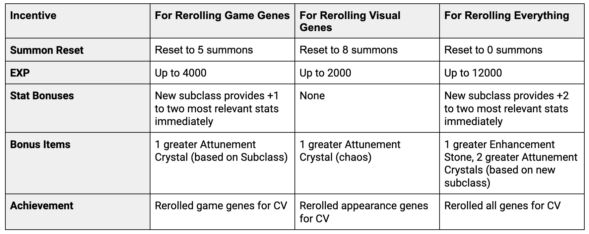

# Adelyn's Reawakening

Il Risveglio di Adelyn è un evento a tempo limitato che consente ai possessori di Eroi Gen0 di "rerollare" alcuni geni dei loro Eroi. Questo viene fatto per garantire che i nuovi geni base introdotti con il rilancio di Serendale abbiano una rarità ed una distribuzione simile tra la popolazione Gen0 rispetto ai 10 set di geni base esistenti.

I possessori di Gen0 Originari e di Crystalvale avranno l'opportunità di rerollare alcuni dei loro geni, includendo i geni più recenti come possibili opzioni. I giocatori avranno un mese di tempo per approfittare di questa opportunità a Crystalvale e potranno ricevere una serie di ricompense.

Le ricompense vengono fornite durante il processo di reroll e non saranno più disponibili al termine dell'evento.

### Tempistiche e Locazione

**Inizio evento:** 7 Dicembre 2022 alle 22 (ora italiana)

Fine dell'evento: 8 Gennaio 2023 alle 05:59 (ora italiana)

Il Risveglio di Adelyn si svolgerà solo a **Crystalvale**. Visitate l'Arcidruido Zagreb al Portale per iniziare.

### "Rilancio" dei Geni&#x20;

Mentre il risveglio di Adelyn è attivo, i giocatori avranno la possibilità di selezionare un Eroe Gen0 da "rilanciare". Sono disponibili le seguenti scelte di rilancio del gene:&#x20;

1. Rilancia i geni di gioco.&#x20;
2. Rilancia i geni estetici.
3. Rilancia i geni del gioco ed estetici.

Solo una di queste azioni può essere selezionata per ogni Eroe Gen0. I seguenti geni verranno rilanciati in base alla selezione effettuata:

**Geni di gioco**

* Geni recessivi della classe principale
* Geni dominanti e recessivi della sottoclasse

**Geni Estetici**

* Geni dominanti e recessivi dell'acconciatura
* Geni dominanti e recessivi del colore dei capelli
* Geni dominanti e recessivi dell'accessorio della testa
* Geni dominanti e recessivi del colore dell'accessorio della testa
* Geni dominanti e recessivi dell'accessorio posteriore
*   Geni dominanti e recessivi del colore dell'accessorio posteriore

    <figure><figcaption>
Le possibilità genetiche estetiche
</figcaption></figure>

### Ricompense

Ognuna delle tre opzioni di rilancio fornisce una serie di ricompense, con le ricompense maggiori derivanti dal rilancio di entrambi i geni del gioco e dell'aspetto. Le ricompense includono bonus di esperienza, bonus statistici, oggetti bonus, un efficace ripristino dell'evocazione e ricompense per i risultati. I premi in relazione alle tre opzioni disponibili sono dettagliati nella tabella seguente:

Rilanciare i geni del vostro Eroe Gen0 aiuterà a bilanciare il pool genetico e dare il via alla comparsa di nuovi geni in tutti i regni DeFi Kingdoms.
