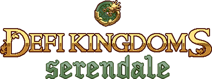
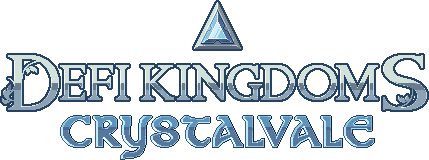
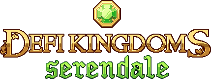

# Roadmap

DeFi Kingdoms continuerà a crescere con nuove caratteristiche, sistemi, mappe e gameplay cross-chain!


Questa tabella di marcia elenca molte, ma non tutte le funzionalità attualmente previste. Sebbene siano generalmente nell'ordine in cui ci aspettiamo che vengano rilasciate, alcune voci potrebbero cambiare ed essere rilasciate prima o dopo, e altre saranno suddivise in parti aggiuntive.

L'elenco che segue è da intendersi come riferimento per gli utenti vecchi e nuovi, mentre una nuova roadmap interattiva sarà rilasciata nel prossimo futuro.


## In Arrivo prossimamente

* **Missioni di Fishing & Foraging Livello 10**: La nostra prima serie di missioni di Professione livello 10 inizierà con Fishing e Foraging e consentirà agli Eroi più esperti di ottenere ricompense maggiori rispetto alle missioni base.
* **Alimentazione & Utilità Pets**: Equipaggiate i vostri amati Animali Domestici ai vostri Eroi per aumentare le loro prestazioni nelle missioni. Ma attenzione: Gli Animali Domestici devono essere nutriti e curati per essere utili compagni!
* **Schiusa delle Uova Verdi (Gardening Pets)**: Dopo la schiusa delle uova blu e grigie, rilasceremo la nostra terza serie di Pets unici in diverse rarità e strane varianti provenientei dalle missioni di Gardening. Equipaggiateli ad un Eroe per potenziare le sue abilità nel Gardening!
* **Tornei**: Una funzione di torneo integrata consentirà ai giocatori di sfidarsi con i propri Eroi in tornei di DFK Duels in stile bracket e di competere per ottenere premi vantaggiosi.
* **Casa d'Aste**: Scambiate materiali o oggetti rari nella nostra Casa d'Aste, che consentirà di effettuare scambi in massa tra i giocatori.
* **Spedizioni**: Questa funzione consentirà ai giocatori di inviare i propri Eroi in missione per periodi di tempo più lunghi. Fino a quando l'utente non terminerà la Spedizione, gli Eroi coltiveranno automaticamente i materiali per il giocatore.
* **Chat In-Game**: Comunica con altri giocatori in tutto il mondo con la nostra funzione di chat in-game: reclutate membri per la Gilda, scambiate Eroi, sfidate giocatori e molto altro ancora!
* **Player vs Player (PVP), Combat System**: La nostra modalità di gioco principale consentirà ai giocatori di combattere contro altri giocatori in una modalità di combattimento a turni animata e ricca di azione, con possibilità pressoché infinite grazie ad un ampio albero delle abilità, all'equipaggiamento dell'Eroe e alle varianti della squadra di Eroi.
* **Missioni di Gardening livello 10**: Affidate ai vostri Eroi esperti le missioni di Gardening livello 10, più impegnativa, per ottenere maggiori ricompense.
* **Missioni di Mining livello 10**: Le ultime missioni di Professione, Gold Mining e Token Mining avranno le loro varianti più impegnative di livello 10.
* **Achievements-Traguardi**: Guadagnate e raccogliete risultati unici con una varietà di compiti impegnativi e mostrateli agli altri giocatori!
* **Schiusa delle Uova Gialle (Mining Pets)**: Esplora molti nuovi animali domestici a tema Mining ed equipaggiali ai tuoi Eroi per aiutarli ad ottenere le migliori ricompense dalle miniere.

## Funzionalità sulla Roadmap Long-Term

* **Equipaggiamento Base**: Guadagna nuovi equipaggiamenti per potenziare i tuoi Eroi nelle battaglie PvP.
* **Sistema di Viaggio**: Gli Eroi potranno ora viaggiare con i loro Animali Domestici tra le diverse regioni della mappa per visitare le Lands e completare le missioni.
* **Schiusa delle Uova d'Oro**: Il quinto ed ultimo tipo di uovo sarà disponibile per la schiusa.
* **Funzionalità Lands**: Le Terre dei regni di DeFi Kingdoms riceveranno una nuova serie di caratteristiche - maggiori dettagli a breve!
* **Implementazione Gilde:** I giocatori potranno creare e gestire Gilde ed accedere a funzioni esclusive.
* **Quest Limitate**: Invia i tuoi Eroi in missioni uniche e limitate per ottenere ricompense speciali.
* **Crafting**: Utilizza i tuoi Eroi per raccogliere e creare vari oggetti ed attrezzature!
* **Player vs Environment (PvE)**: Dopo il rilascio del PvP, gli Eroi possono ora azzuffarsi e mettere alla prova la loro forza contro vari nemici NPC.
* **Dungeons**: Invia i tuoi Eroi a combattere ed esplorare dungeon unici.
* **PvP su Larga Scala**: Gareggia con i tuoi Eroi in eventi mondiali su larga scala e sfida nemici spaventosi!

## Traguardi Raggiunti

### 2023

#### Marzo

* :white\_check\_mark: **Combat Testing Grounds**: Accesso Pre-Alpha alla nostra imminente funzione di combattimento PVP, sviluppata in collaborazione con [Wisdom Gaming](https://www.wisdom.gg/). Provate le abilità e le capacità degli Eroi e fornite preziosi test e feedback, il tutto mentre combattete contro un branco di famelici blub! Nuove classi di Eroi e funzionalità aggiuntive saranno aggiunte costantemente a questa versione iniziale.

#### Febbraio

* :white\_check\_mark: **Commissioni Differite & Offerte di Tokens**: La nuova Struttura delle Commissioni Differite consente ai giocatori di differire le spese di gioco utilizzando i Tokens Bloccati. Le Offerte di Tokens danno ai giocatori la possibilità di vincere oggetti rari in cambio di Offerte di Tokens bloccati o sbloccati.

#### Gennaio

* :white\_check\_mark: **Power-Ups**: Utilizza i tuoi cJEWEL e sJEWEL per sbloccare altre caratteristiche! I primi due potenziamenti permettono ai tuoi Eroi di guadagnare più esperienza e di recuperare più velocemente la loro Stamina, e molti altri potenziamenti verranno lanciati in futuro.

### 2022

#### Dicembre

<figure><figcaption></figcaption></figure>

* :white\_check\_mark: **Lancio su Klaytn di Serendale 2.0** : Serendale è tornato su una nuova casa! Il mondo che conoscete e amate è ora accessibile sulla blockchain **Klaytn**, con il nuovo Power Token **JADE** ed un totale di quattro nuove classi: le classi base **Legionaire** e **Scholar**, oltre alla classe avanzata **Bard** ed alla classe elitè **SpellBow**.

#### Novembre

* :white\_check\_mark: **Jeweler 2.0 (cJEWEL/sJEWEL)**: Il nostro xJEWEL a deposito singolo è sostituito da cJEWEL (Crystalvale) e sJEWEL (Serendale). Blocca i tuoi JEWEL per ricevere le commissioni di gioco: più a lungo lo blocchi, più cJEWEL/sJEWEL ricevi, e con essi premi più alti.
* :white\_check\_mark: **Dark Summoning**: Questa funzione consente ai giocatori di sacrificare due Eroi per evocare un nuovo Eroe. La ricompensa per aver pagato il prezzo del sangue è che questo rituale di evocazione ha costi più bassi, maggiori possibilità di ottenere Eroi più rari ed alcuni dei livelli dei genitori vengono riportati sul nuovo arrivato.

#### Ottobre

* :white\_check\_mark: **La Calamità su Serendale 1.0**: Serendale sta cadendo a pezzi! **DeFi Kingdoms lascia ufficialmente la blockchain Harmony** - ma Serendale tornerà presto. Un piccolo avamposto permetterà ancora ai giocatori di trasferire i loro beni rimanenti sulla DFK Chain.
* :white\_check\_mark: **Pet Bridge**: Utilizzate i Docks per inviare i vostri Pets a Crystalvale, mentre nuvole oscure si addensano sulla loro patria. Il Pet Bridge è alimentato dal protocollo di messaggistica cross-chain di [Synapse](https://explorer.synapseprotocol.com/).

#### Settembre

* :white\_check\_mark: **Stone Carver a Crystalvale**: I giocatori possono ora creare Enhancement Stones a Crystalvale.
* :white\_check\_mark: **Schiusa dei Pets a Crystalvale**: I Pets sono ora disponibili a Crystalvale!
* :white\_check\_mark: **Multi-Questing**: Questa nuova funzione consente di accodare ed inviare più missioni contemporaneamente.
* :white\_check\_mark: **Integrazione Kingdom Builder**: Visita il Jester e l'Archivist nel Castello per saperne di più su giochi, applicazioni e strumenti costruiti intorno a DeFi Kingdoms dai membri della nostra Community e dai nostri partner.
* :white\_check\_mark: **Missioni di Gardening a Crystalvale**: Le nostre missioni di Gardening sono ora attive su Crystalvale. Oltre a guadagnare CRYSTAL, i giocatori possono ora inviare un secondo Eroe per guadagnare anche JEWEL!

#### Agosto

* :white\_check\_mark: **Item Bridge**: I giocatori possono ora inviare i loro oggetti di gioco avanti e indietro tra i reami, grazie al protocollo di messaggistica cross-chain di [Layer Zero](https://layerzero.network/).
* :white\_check\_mark: **Il Castello di Crystalvale**: Visita il Re dei Nani nel suo castello, che in futuro ospiterà diversi NPC.
* :white\_check\_mark: **Missioni di Addestramento a Crystalvale**: Le Missioni di Addestramento sono ora attive a Crystalvale.
* :white\_check\_mark: **Redesign del Vendor**: Il Vendor del Marketplace ora fissa i prezzi in base alla domanda e all'offerta: se molti giocatori acquistano un oggetto, il prezzo aumenta, ma se la domanda diminuisce, il prezzo si riduce.

#### Luglio

* :white\_check\_mark: **Alchemist a Crystalvale**: L'Alchimista è ora accessibile a Crystalvale per la creazione di Pozioni.
* :white\_check\_mark: **Missioni di Mining a Crystalvale**: Utilizza i tuoi Eroi per estrarre e sbloccare alcuni dei tuoi CRYSTAL bloccati o per guadagnare Gold!
* :white\_check\_mark: **Livellaggio Eroi a Crystalvale**: I giocatori possono ora far salire di livello i loro Eroi a Crystalvale.
* :white\_check\_mark: **Missioni di Fishing e Foraging a Crystalvale**: Gli Eroi possono ora pescare e raccogliere piante utili a Crystalvale, dove possono trovare ricompense per le missioni specifiche del regno.
* :white\_check\_mark: **Lancio del Merch Store**: Mettete le mani sugli esclusivi gadget di DeFi Kingdoms nel nostro nuovo negozio di gadget!

#### Giugno

* :white\_check\_mark: **Lancio di DFK Duels**: Combatti contro gli Eroi di altri giocatori nel minigioco **DFK Duels** e guadagna biglietti della lotteria, che possono essere utilizzati per ottenere ricompense vantaggiose.

#### Maggio

* :white\_check\_mark:  **Rework #2 Marketplace**: Il nostro Marketplace ha ricevuto la sua seconda rielaborazione visiva.
* :white\_check\_mark: **Rilascio dei Pets NFT**: Schiudi le tue uova blu e grigie per ricevere i Pets NFT! Centinaia di animali domestici di diverse rarità - ed alcuni animali domestici unici e strani - stanno iniziando a popolare Serendale. In futuro, gli animali domestici potranno essere equipaggiati sugli Eroi per potenziare le loro statistiche ed abilità; seguiranno animali domestici provenienti da uova verdi, gialle e dorate!
* :white\_check\_mark: **Rilascio dello Stone Carver**: È stato aggiunto un nuovo NPC al **Portale**: lo Stone Carver è in grado di creare preziose Enhancement Stones con i giusti materiali.
* :white\_check\_mark: **Hero Bridge**: Invia i tuoi Eroi tra Serendale e Crystalvale tramite i Docks, grazie al protocollo di messaggistica cross-chain di [Synapse](https://explorer.synapseprotocol.com/).
* :white\_check\_mark: **Summoning a Crystalvale**: I giocatori possono ora evocare nuovi Eroi a Crystalvale utilizzando il nuovo Power Token CRYSTAL.

#### Aprile

* :white\_check\_mark: **Portale, Meditation Circle e Taverna a Crystalvale**: Tre nuove zone sono disponibili su Crystalvale con pixel art e musiche personalizzate!
* :white\_check\_mark: **Missioni di Addestramento**: Viene lanciata una nuova serie di missioni: usate i vostri Eroi per competere in una prova di abilità e guadagnare esperienza, Gold o oggetti rari.

#### Marzo

* :white\_check\_mark: **Bridge Cross-Chain**: Utilizzando i Docks, i giocatori possono ora inviare i loro tokens tra Serendale e Crystalvale attraverso il protocollo di messaggistica cross-chain di [Synapse](https://explorer.synapseprotocol.com/).
* :white\_check\_mark: **Leaderboards**: Gareggia con altri giocatori in missioni uniche giornaliere, settimanali e mensili per ottenere ricompense vantaggiose.

<figure><figcaption></figcaption></figure>

* :white\_check\_mark: **Lancio di Crystalvale e DFK Chain**: La nostra prima espansione a tema invernale **Crystalvale** viene lanciata sulla nostra [DFK Chain](come-funziona-defi-kingdoms/defi-kingdoms-blockchain.md), una sottorete [Avalanche](https://www.avax.network/subnets). I giocatori potranno esplorare una regione completamente nuova con una nuova serie di Eroi Gen0 che presentano le nuove classi **Seer** e **Berserker**, oltre alla classe avanzata **Shapeshifter**. Questo regno presenta anche un nuovo **Power Token: CRYSTAL**.

#### Febbraio

* :white\_check\_mark: **Il Perilous Journey**: Un evento unico che precede l'uscita della nostra prima espansione! Mandate i vostri Eroi a navigare per tracciare la rotta verso Crystalvale - ma attenzione, il mare è pericoloso e non tutti gli Eroi possono tornare vivi!

#### Gennaio

* :white\_check\_mark: **Estensione della Mappa del Mondo**: Con l'uscita delle Lands, la nostra mappa del mondo si è ampliata, permettendo ai giocatori di esplorare molte regioni diverse di Serendale.
* :white\_check\_mark: **Rilascio delle Lands**: È stato rilasciato un nuovo set unico di NFT, le Lands. I giocatori possono possedere e scambiare le terre, che in futuro ospiteranno diverse caratteristiche ed eventi.
* :white\_check\_mark: **Zona Castello**: Il grande castello di Serendale è ora visitabile!
* :white\_check\_mark: **Missioni di JEWEL Mining**: Dopo il Gold Mining, i giocatori possono ora inviare gli Eroi per sbloccare alcuni dei loro Locked JEWEL.

### 2021

#### Dicembre

* :white\_check\_mark: **Missioni di Gold Mining**: Il Mining, la quarta ed ultima missione delle Professioni, inizia con il Gold Mining, che consente ai giocatori di far estrarre ai loro Eroi Gold.
* :white\_check\_mark: **Zona Alchimista**: Visitate l'Alchimista per creare potenti pozioni che aiuteranno il vostro Eroe in battaglia o ricaricheranno la sua Stamina.
* :white\_check\_mark: **Missioni di Gardening**: La nostra terza missione di professione, Gardening, è disponibile e permette ai giocatori di guadagnare ricompense in base alla quantità di semi (tokens LP) che hanno piantato nei Gardens.
* :white\_check\_mark: **Livellaggio Eroi**: Una volta che la barra dell'esperienza del vostro Eroe è piena, può visitare la zona del **Meditation Circle** per salire di livello e migliorare le sue statistiche.
* :white\_check\_mark: **Vendor**: Il Venditore di oggetti apre il suo negozio e permette di vendere le ricompense delle missioni in cambio di Gold. Ha anche alcuni oggetti preziosi in magazzino che il giocatore può acquistare!
* :white\_check\_mark: **Zona Meditation Circle**: È stata scoperta una nuova zona: il Meditation Circle è ancora in carica, ma presto i vostri Eroi potranno usare questa zona per salire di livello.
* :white\_check\_mark: **Missioni di Fishing e Foraging**: La nostra prima serie di Missioni di Professione inizia con Fishing e Foraging! Inviate i vostri Eroi in missione per guadagnare esperienza, preziose ricompense e materiali.

#### Novembre

* :white\_check\_mark: **Zona Docks**: I Moli sono aperti - in futuro le navi permetteranno di viaggiare in altre regioni su altre blockchain.
* :white\_check\_mark: **Rilascio della Mappa del Mondo**: I giocatori possono ora esplorare la Mappa del Mondo e navigare direttamente tra le zone.
* :white\_check\_mark: **Rework #1 Marketplace**: La nostra zona Marketplace ha ricevuto la sua prima rielaborazione visiva!

#### Ottobre

* :white\_check\_mark: **Taverna & Vendite Eroi**: La **Taverna del Focolare Scarlatto** apre le sue porte, consentendo l'acquisto, la vendita e l'affitto di Eroi.
* :white\_check\_mark: **Zona Portale & Evocazione Eroi**: I giocatori possono ora utilizzare due Eroi per evocare un nuovo Eroe, caratterizzato dai tratti genetici dei Eroi genitori nella nuova zona del Portale.

#### Settembre

* :white\_check\_mark: **Vendita dei Genesis Gen0**: La creazione degli Eroi Genesis Gen0 ha segnato il lancio dei nostri Eroi NFT. I 2000 Eroi Gen0 limitati, esauriti in pochi minuti, erano gli antenati genetici di tutti i futuri Eroi Serendale.

#### **Agosto**

<figure><figcaption></figcaption></figure>

* :white\_check\_mark: **Lancio di DeFi Kingdoms**: Il 22 Agosto 2021 è stato lanciato ufficialmente DeFi Kingdoms, caratterizzato da un'interfaccia in pixel art, da uno scambio decentralizzato tramite il **Trader** e dai **Gardens**, che consentono di depositare tokens LP e di guadagnare **JEWEL**.
